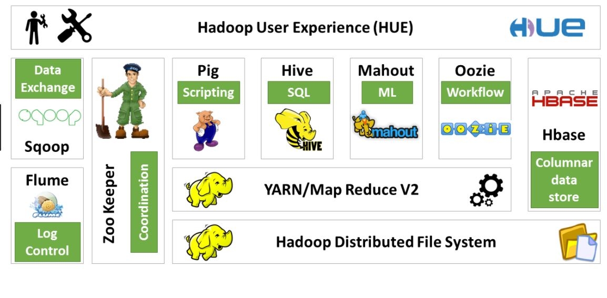

# 1. 아파치 하둡이란?

- 빅데이터를 수집, 저장, 처리, 분석 할 수 있는 소프트웨어 프레임워크
- 주요 특징
  - Ditributed : 수십만대의 컴퓨터에 자료 분산 저장 및 처리
  - Scalable : 용량이 증대되는 대로 컴퓨터 추가
  - Fault-tolerant : 하나 이상의 컴퓨터가 고장나도 시스템이 정상 동작
  - Open source : 공개 소프트웨어

# 2. hadoop을 왜 쓰는가?

- 데이터 크기가 커져 가면서, 저장과 처리를 어떻게 할지에 대해 고민을 하게됨

# 2.1 전통적인 고성능 서버 방식의 한계

- 더 많은 데이터를 처리하기 위해서는 더 빠른 Scale-up을 수행
  - scale-up : processor와 memory를 확장하여 해결
- 하지만, 지속적으로 향상시키는데에는 한계가 존재함

# 2.2 분산 처리 시스템 방식 도입-1(MPI)

- 하나의 작업을 처리하기 위해 여러 대의 컴퓨터를 사용
- 더 많은 데이터를 처리하기 위해서는 더 많은 컴퓨터를 확장하여 해결
- 분산 처리를 위해 MPI(Message Passing Interface) 방법을 사용
  - 컴퓨터 사이에 메시지를 전달하여 분산 처리를 수행함
  - 하지만 복잡하여 사용하기 어려움

# 2.3 분산 처리 시스템 방식 도입-2(GFS+MR , Haddop)

- 구글에서 저성능 서버 여러 대에 데이터를 분선 저장/처리 하는 시스템 개발함
  - GFS(GoogleFile System) 라고 하는 파일 저장 관리 시스템을 개발
  - MR(MapReduce)라고 하는 분산 데이터 처리 방법을 개발
- 하지만 Google에서 해당 기술을 Open하지 않음
- Apache 에서 GFS와 MR을 참고하여 Hadoop이라고 하는 기술을 개발하여 open함

# 3. hadoop ecosystem

- 데이터 수집
  - Sqoop : 정형데이터(관계형 데이터베이스등)에 있는 데이터를 가져 오는 프로그램
  - Flume : 비정형데이터(로그파일 등)에 있는 데이터를 가져오는 프로그램
- 데이터 저장
  - HDFS(Haddop Distributed File System) : 데이터를 분산하여 저장하는 파일시스템
  - HBase : 컬럼기반 NoSQL 데이터베이스
- 데이터 처리/분석
  - YARN/Map Reduce : 분산 데이터 처리
  - Pig : 스크리브 언어 기반 분석 도구
  - Hive : SQL기반 분석 도구
  - Mahout : 기계학습 알고리즘 기반 데이터 처리
- 데이터 관리
  - Oozie : 빅데이터 처리 과정 관리
  - HCatalog : 빅데이터 메타 정보 관리
  - Zoo keeper : 빅데이터 서버 시스템 관리
- Hadoop ecosystem 관리
  - Hue : 하둡의 프로그램들을 쉽게 실행시키는 동작하는 프로그램

# 참고

- [숭실대\_박영택교수님\_Distributed Computing for Big Data](http://ssuocw.ssu.ac.kr/post/906)
- [hadoop eco system\_이상철교수님](https://www.youtube.com/watch?v=0RJ6KQpf4Oc)
