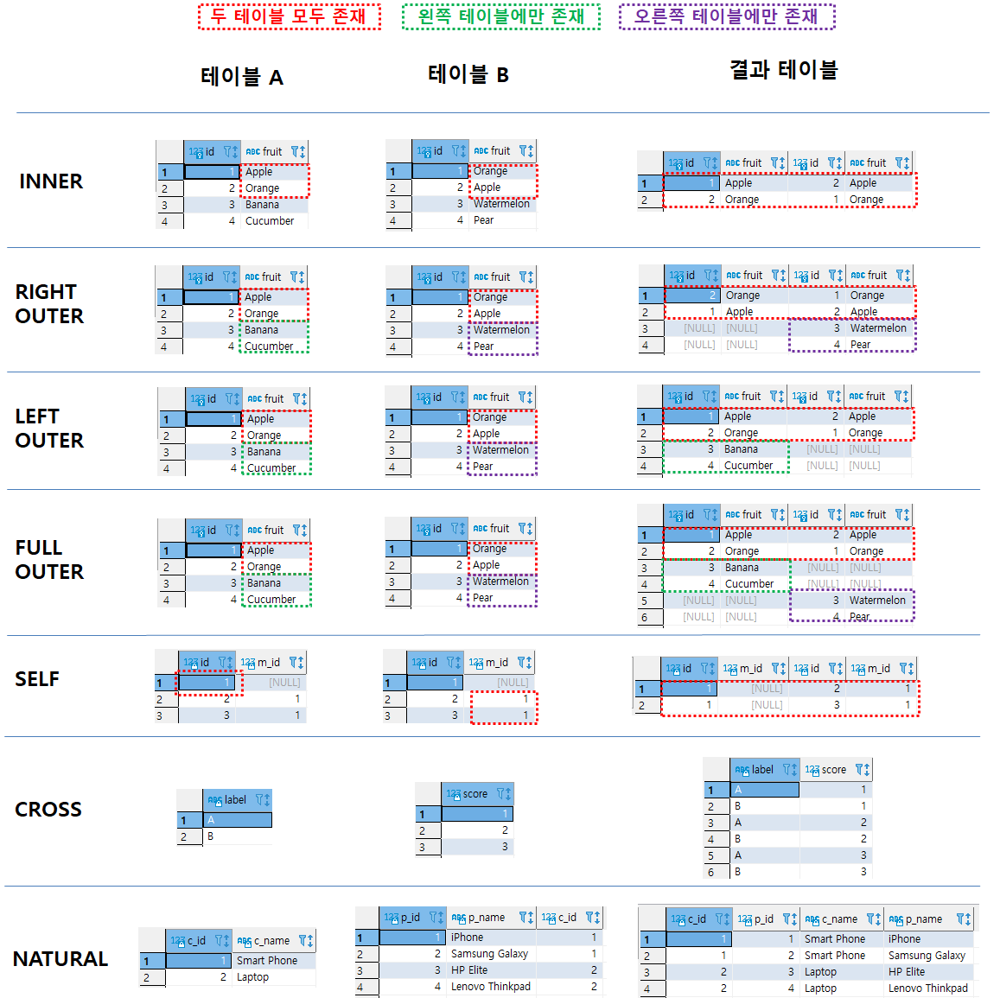

# 1. Join의 종류

- Join이란?
  - 두 테이블에 공통으로 있는 칼럼을 이용해 연결 시키는 것

| 종류        | 설명                                                                                       |
| ----------- | ------------------------------------------------------------------------------------------ |
| INNER       | 조건이 정확히 일치하는 데이터만 출력                                                       |
| LEFT OUTER  | 앞에 있는 데이터는 모두 출력, 뒤에 있는 데이터는 조건이 일치하는 데이터 출력 + 없으면 NULL |
| RIGHT OUTER | 뒤에 있는 데이터는 모두 출력, 앞에 있는 데이터는 조건이 일치하는 데이터 출력 + 없으면 NULL |
| FULL OUTER  | 앞뒤 모든 일치하는 데이터 출력, 없으면 NULL                                                |
| SELF        | 동일한 테이블끼리 수행하는 INNER JOIN                                                      |
| CROSS       | 두 테이블 컬럼의 곱집합 출력                                                               |
| NATURAL     | 두 테이블의 같은 이름의 컬럼 기준으로 INNER JOIN                                           |

# 2\. Join의 문법

| 종류        | 문법                                                                                                                                                                                  |
| ----------- | ------------------------------------------------------------------------------------------------------------------------------------------------------------------------------------- |
| INNER       | 테이블1 A <span style = "color:blue">INNER JOIN</span> 테이블2 B <span style = "color:blue">ON</span> A.KEY = B.KEY                                                                   |
| LEFT OUTER  | 테이블1 A <span style = "color:blue">LEFT OUTER JOIN</span> 테이블2 B <span style = "color:blue">ON</span> A.KEY = B.KEY                                                              |
| RIGHT OUTER | 테이블1 A <span style = "color:blue">RIGHT OUTER JOIN</span> 테이블2 B <span style = "color:blue">ON</span> A.KEY = B.KEY                                                             |
| FULL OUTER  | 테이블1 A <span style = "color:blue">FULL OUTER JOIN</span> 테이블2 B <span style = "color:blue">ON</span> A.KEY = B.KEY                                                              |
| SELF        | <span style = "color:red">테이블1</span> A <span style = "color:blue">INNER JOIN</span> <span style = "color:red">테이블1</span> B <span style = "color:blue">ON</span> A.KEY = B.KEY |
| CROSS       | 테이블1 A <span style = "color:blue">CROSS JOIN</span> 테이블2 B                                                                                                                      |
| NATURAL     | 테이블1 A <span style = "color:blue">NATURAL JOIN</span> 테이블2 B                                                                                                                    |

# 3. Join 예시

- INNER JOIN

```SQL
SELECT * FROM BASKET_A BA
INNER JOIN BASKET_B BB
ON BA.FRUIT = BB.FRUIT
```

- LEFT OUTER JOIN

```sql
SELECT * FROM BASKET_A BA
LEFT OUTER JOIN BASKET_B BB
ON BA.FRUIT = BB.FRUIT
```

- RIGHT OUTER JOIN

```sql
SELECT * FROM BASKET_A BA
RIGHT OUTER JOIN BASKET_B BB
ON BA.FRUIT = BB.FRUIT
```

- FULL OUTER JOIN

```sql
SELECT * FROM BASKET_A BA
FULL OUTER JOIN BASKET_B BB
ON BA.FRUIT = BB.FRUIT
```

- SELF JOIN

```sql
SELECT A.EMPLOYEE_ID AS ID, A.MANAGER_ID AS M_ID
	,B.EMPLOYEE_ID AS ID,  B.MANAGER_ID AS M_ID
FROM EMPLOYEE A
INNER JOIN EMPLOYEE B
ON A.EMPLOYEE_ID = B.MANAGER_ID
```

- CROSS JOIN

```sql
SELECT * FROM CROSS_T1 A
CROSS JOIN CROSS_T2 B
```

- NATURAL JOIN

```sql
SELECT CATEGORY_ID AS C_ID, PRODUCT_ID AS P_ID
      , CATEGORY_NAME AS C_NAME ,PRODUCT_NAME AS P_NAME
FROM PRODUCTS NATURAL JOIN CATEGORIES
```



# \# 참고

​

- [모두를 위한 SQL/DB 올인원 패키지 Online(패스트 캠퍼스)](fastcampus.co.kr/data_online_sqldb)
