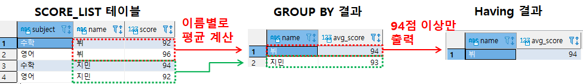
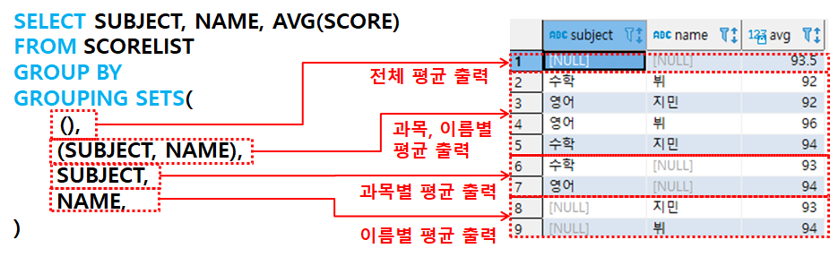
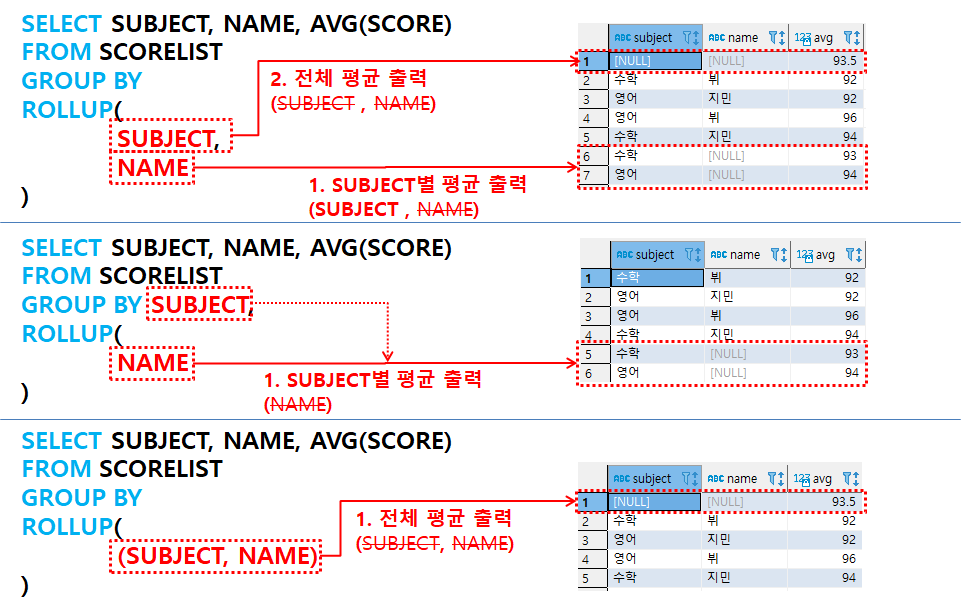
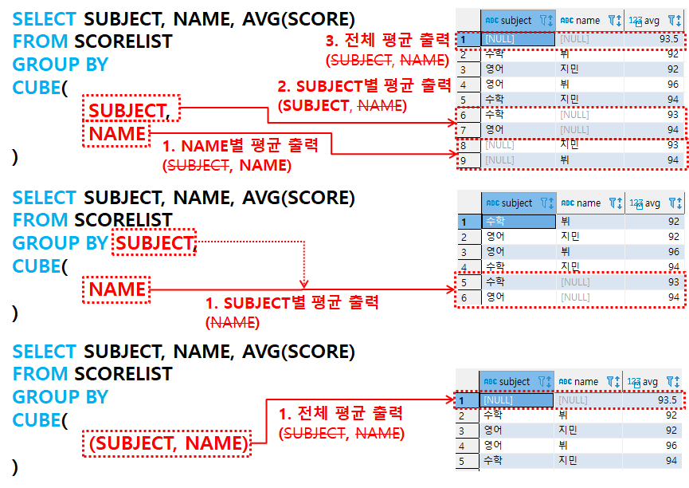

# 1. Group by절

- Group by 란?
  - 특정 컬럼값을 기준으로 그룹화함
  - 각 그룹에 대한 합계, 평균, 개수 등의 함수 적용 가능
  - 예) 이름으로 그룹핑 및 각 그룹의 평균 계산 후 평균으로 내림차순 정렬

```sql
SELECT NAME, AVG(SCORE) AS AVG_SCORE
FROM SCORELIST GROUP BY NAME
ORDER BY AVG_SCORE DESC
```

# 2. Having절

- Having 절이란?
  - Group by의 결과를 특정조건으로 필터링하는 기능
  - 예시) 평균이 94점 이상인 이름(그룹)만 출력

```sql
SELECT NAME, AVG(SCORE) AS AVG_SCORE
FROM SCORELIST GROUP BY NAME
having AVG(SCORE)  >= 94
```



# 3. GROUPING SETS절

- Grouping sets절이란?

  - 여러 칼럼에 대한 여러 개의 집계를 한번에 출력할 때 사용

- Grouping sets의 필요성
  - 만약 과목별 평균과 이름별 평균, 전체 평균 정보를 한번에 보고 싶다면...
  - 아래와 같이 하나씩 Group by 한 결과를 Union All 해서 출력 가능

```sql
-- 1. 전체 평균 계산
SELECT NULL,   NULL, AVG(SCORE) FROM SCORELIST
-- 2. 과목, 이름별 평균 계산
UNION ALL
SELECT SUBJECT, NAME, AVG(SCORE) FROM SCORELIST GROUP BY SUBJECT, NAME
-- 3. 과목별 평균 계산
UNION ALL
SELECT SUBJECT, NULL, AVG(SCORE) FROM SCORELIST GROUP BY SUBJECT
-- 4. 이름별 평균 계산
UNION ALL
SELECT NULL,    NAME, AVG(SCORE) FROM SCORELIST GROUP BY NAME
```

- 상기 예제를 Grouping sets 절로 구현
  - 수행 속도가 더 빠르고 간단함

```sql
SELECT SUBJECT, NAME, AVG(SCORE) FROM SCORELIST
GROUP BY
GROUPING SETS(
	(SUBJECT, NAME),
	SUBJECT,
	NAME,
	()
)
```



# 4. ROLL UP 절

- ROLL UP 이란?
  - 지정된 GROUPING 컬럼의 소계를 생성함
- ROLL UP의 원리
  - 인자로 들어온 컬럼을 오른쪽부터 하나씩 빼면서 Group 생성
- 예제 1, 2, 3 비교(아래 그림 참고)
  - SUBJECT, NAME 으로 그룹핑 하여 평균 출력하는 부분은 동일함
    
- 예제 1) <span style= "color:blue">GROUP BY ROLLUP</span>( <span style = "color:red">SUBJECT, NAME</span> )
  - SUBJECT, NAME에서 오른쪽인 NAME이 제외된 SUBJECT 그룹으로 평균 출력
  - 그 다음으로 SUBJECT가 제외되어 아무것도 없고 GROUP BY절에도 아무것도 없으므로 전체 평균 출력
- 예제 2) <span style= "color:blue">GROUP BY</span> <span style = "color:red">SUBJECT</span>, <span style= "color:blue">ROLLUP</span>( <span style = "color:red">NAME</span> )
  - ROLLUP에 NAME뿐이어서 NAME이 제외되면 아무것도 없으므로 GROUP BY에 있는 SUBJECT 그룹으로 평균 출력
- 예제 3) <span style= "color:blue">GROUP BY ROLLUP</span>(<span style = "color:red">(SUBJECT, NAME)</span>)
  - ROLLUP에 SUBJECT, NAME이 괄호안에 하나의 그룹이고, 제외 되면 아무 것도 없으므로 전체 평균 출력

# 5. CUBE 절

- CUBE란?
  - 지정된 GROUPING 컬럼의 다차원 소계를 생성함
- ROLL UP과의 차이

  - ROLL UP은 오른쪽부터 순서대로 하나씩 뺌
  - CUBE는 방향 상관없이 하나씩 빼며 모든 가능한 조합의 Group 생성
  - CUBE와 ROLLUP의 그룹 조합 차이

    | CUBE(C1, C2) | ROLLUP(C1,C2) |
    | ------------ | ------------- |
    | C1, C2       | C1, C2        |
    | C1           | C1            |
    | C2           | X             |
    | ()           | ()            |

- 예제 1, 2, 3 비교(아래 그림 참고)
  - SUBJECT, NAME 으로 그룹핑 하여 평균 출력하는 부분은 동일함
    
- 예제 1) <span style= "color:blue">GROUP BY CUBE</span>( <span style = "color:red">SUBJECT, NAME</span> )
  - SUBJECT, NAME에서 NAME이 제외된 SUBJECT 그룹으로 평균 출력
  - SUBJECT, NAME에서 SUBJECT가 제외된 NAME 그룹으로 평균 출력
  - 그 다음으로 모두 제외되어 아무것도 없고 GROUP BY절에도 아무것도 없으므로 전체 평균 출력
- 예제 2) <span style= "color:blue">GROUP BY</span> <span style = "color:red">SUBJECT</span>, <span style= "color:blue">CUBE</span>( <span style = "color:red">NAME</span> )
  - CUBE에 NAME뿐이어서 NAME이 제외되면 아무것도 없으므로 GROUP BY에 있는 SUBJECT 그룹으로 평균 출력
- 예제 3) <span style= "color:blue">GROUP BY CUBE</span>(<span style = "color:red">(SUBJECT, NAME)</span>)
  - CUBE에 SUBJECT, NAME이 괄호안에 하나의 그룹이고, 제외 되면 아무 것도 없으므로 전체 평균 출력

# \# 참고

- [모두를 위한 SQL/DB 올인원 패키지 Online(패스트 캠퍼스)](fastcampus.co.kr/data_online_sqldb)
