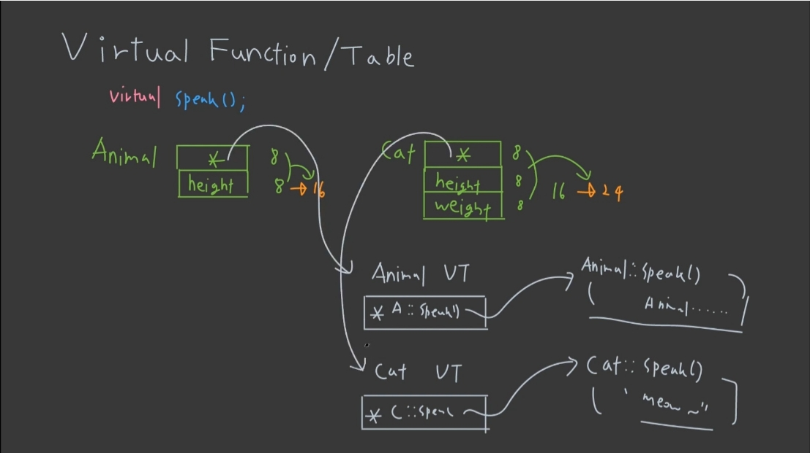
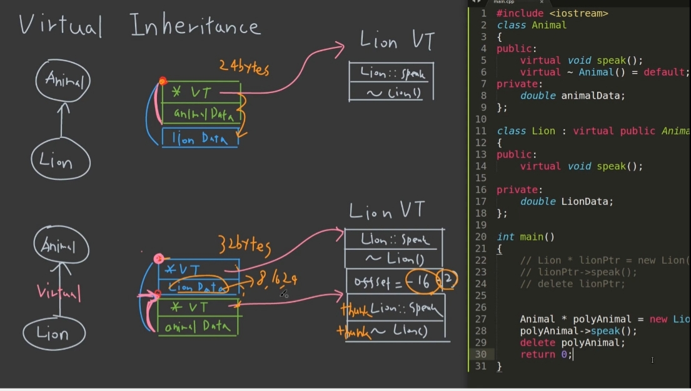
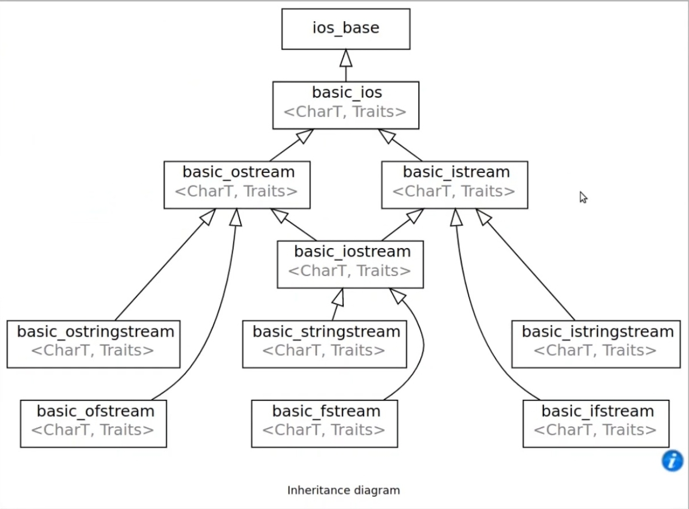

# 1. 헤더 가드

1. 필요성
   - 헤더가 중복으로 로딩되면 오류가 발생할 수 있음
   - 이미 헤더가 로딩되었을 경우는 로딩하지 않도록 정의
2. 사용방법
   - C style

```cpp
#ifndef TEST
    #def TEST
    //헤더 내용
#endif
```

- C++ style

```cpp
#progma once
    //헤더 내용
```

# 2.구조체와 클래스 유일한 차이

1. 별도의 접근제어 지시자를 입력하지 않으면
   - 구조체 : public이 default
   - 클래스 : private이 default

# 3. inline 함수

1. 매크로 함수 특징(#define)
   - 일반 함수보다 실행속도가 빠르다.
   - 복잡한 함수를 정의하기 어렵다.
   - 전처리기에 의해 처리된다.
   - 자료형에 의존적이지 않은 함수 가능
   - 사용 방법

```cpp
#define SQUARE(x) ((x)*(X))
```

2. inline 함수 특징
   - 컴파일러에 의해 처리된다.
   - 템플릿을 이용해 자료형에 의존적이지 않은 함수 가능
   - 사용 방법

```cpp
inline int SQUARE(int x){
    return x*x;
}
```

# 4. 객체간의 대화방법(Message Passing)

1. 한 객체가 다른 각체에게 메시지 전달 방법

   ex) seller 아저씨 사과 2000원 어치 주세요.

```cpp
void Buyer::BuyApples(Seller &sel, int mon)
```

# 5. const

1. const 함수
   - 함수 내에서 멤버 변수를 변경 안함
   - 함수 내에서 const가 아닌 함수 호출 제한

```cpp
int GetY() const;
```

2. const 객체
   - 객체는 const 멤버 함수만 호출 가능

```cpp
const Simple sim(20)
```

3. mutable 키워드

   - const 함수에서 예외적으로 값 변경 허용

```cpp
mutable int num;
```

# 6. 멤버 이니셜라이저

```cpp
Point pos;
string name;
car::car(int x, int y, string s)
    : pos(x,y), name(s) {}
```

1. 객체 pos에 x,y를 전달받는 생성자 호출
2. 일반적인 변수(name)도 이니셜라이저로 초기화 가능
3. 선언과 동시에 초기화 해주는 형태로 바이너리 코드가 생성됨
4. const 변수도 초기화 가능함
5. 참조자도 초기화 가능함

```cpp
Position& pos
Car(Position &pos1) : pos(pos1) {}
```

# 7. 생성자

1. 생성자를 생략해도 무조건 생성자 호출됨
   - Default 생성자가 자동 생성 후 호출됨
2. malloc으로 객체 생성 시 생성자 호출 안됨
3. new로 객체 생성 시 생성자 호출됨
4. 생성자가 있으면 Default 생성자 자동 생성 안됨

# 8. Self reference

1. this 포인터를 이용해 자기자신을 반환 가능

```cpp
SelfRef& Add(int a){
    this->num+=a;
    return *this;
}
```

- ref.Add(1).Add(1)과 같이 사용 가능

# 9. 복사 생성자

1. 복사 생성자 미정의시 Default 복사 생성자 생성

```cpp
Simple(const Simple& copy)
```

2. 복사생성자 인자에는 반드시 &가 있어야함
3. explicit 키워드
   - 아래와 같은 묵시적 변환이 안 일어나게 하는 것
   - 묵시적 변환이 많으면 코드 예측 어려움

```cpp
Simple sim2 = sim1
// Simple sim2(sim1)
// => 위와 같은 형태로 묵시적 변환 일어남
// => explicit 키워드 붙혀줌
explicit Simple(const Simple &copy)
```

4. 얕은 복사
   - 포인터 변수 복사 시 원래 변수의 주소만 복사함
   - 원래 변수가 변경되면 같이 변경됨
   - Default 복사 생성자는 얕은 복사 수행
5. 깊은 복사
   - 포인터 변수 복사 시 메모리를 재할당 받도록 복사 생성자를 별도로 정의
6. 복사 생성자의 호출 시점(3가지)

1)기존 객체를 이용해 새로운 객체를 초기화

```cpp
Simple sim = sim2
```

2)call by value 방식으로 객체를 인자로 전달

```cpp
void func(Simple sim)
```

3)참조형이 아닌 객체 반환

- func에서 return 될 때 임시 객체 생성
- 받는 ref가 없으면 임시 객체 즉시 소멸
- 받는 ref가 있으면 받는 ref가 소멸될 때 소멸
- ref는 임시객체에 이름만 부여(재복사 안함)

```cpp
Simple func(Simple ref) {
    return ret;
}

Simple ref = func(obj);
```

# 10. friend

1. A클래스에서 B클래스를 friend 선언 시
   - B클래스에서 A클래스의 private 멤버 접근 가능
   - friend 선언 시에 클래스 원형 선언도 포함함

```cpp
class B; // friend 선언시 원형을 포함하므로 이구문 필요 없음

// A클래스 에서 아래 입력...
friend class B;
```

2. A클래스에서 friend 함수 선언 시
   - 함수에서 private 멤버 접근 가능

```cpp
// A클래스에서 아래 입력...
friend void showPtn(const Point& pnt)

void showPtn(const Point& pnt){
    // A클래스 멤버 접근 가능
}
```

3. friend는 가급적 사용을 지양
   - 꼭 필요한 경우에만 사용

# 11. static

1. static 멤버 변수(클래스 변수)
   - 클래스 당 하나씩만 생성됨
   - public으로 선언시 클래스명::변수명 사용 가능
   - 클래스 밖에서 초기화 필요

```cpp
// Simple 클래스
static int cnt;

// 클래스 외부에서 초기화 필요
int Simple::cnt = 0;
```

2. static 멤버 함수

   - 함수 내부에서 static 멤버 변수와 static 멤버 함수만 호출 가능
   - 일반 멤버 변수 접근 불가
   - 클래스명::함수명() 형태로 사용 가능

3. const static 멤버
   - 선언과 동시에 초기화 가능

```cpp
const static int KOR = 100;
```

# 12. 상속

1. 자식 클래스 생성자에서 부모 클래스 생성자를 명시하지 않으면 부모 클래스의 void 생성자 호출
2. protected 상속
   - public 멤버는 protected로 변경하여 상속
3. public 상속
   - 별도 변경 없음
4. private 상속
   - 모든 멤버를 private로 변경하여 상속
5. 상속의 조건
   - is a 관계(노트북 is a 컴퓨터)가 성립해야함
6. has a 관계도 상속 가능하지만 일반적으로 다른 기술들 사용

# 13. 상속과 다형성

1. 부모 클래스 포인터 변수는 모든 자식 객체를 가리킬 수 있다

```cpp
base* ptr = new derived();
```

2. 그러나 함수 호출은 포인터형에 해당하는 멤버만 호출 가능

```cpp
ptr->derivedFunc() // (X)
```

3. virtual 함수 사용시 포인터 변수가 실제 가리키는 객체를 참조하여 호출 대상 결정

```cpp
virtual void myFunc();

Person* ptr = new Student();
ptr->myFunc(); // => Student의 myFunc 호출됨
```

4. 순수 가상 함수
   - 함수의 몸체를 정의하지 않음을 컴파일러에 알림
   - 순수 가상함수를 지닌 클래스는 객체 생성 불가

```cpp
virtual int getPay() = 0;
```

5. 가상 소멸자

```cpp
// 1. 일반 소멸자 정의
~Person();

Person* ptr = new Student();
delete ptr; // => Person의 소멸자만 호출됨

// 2. 가상 소멸자 정의
virtual ~Person();

Person* ptr = new Student();
delete ptr; // => Student 소멸자도 호출됨
```

# 14. 가상의 원리와 다중 상속



1. virtual 함수 생성하면 컴파일 시 포인터 주소 추가
   - 64비트 기준 객체의 크기가 8바이트 증가
   - 포인터는 virtual 테이블을 가리킴
2. virtual 테이블이 각 함수를 가리킴

   - Animal VT는 Animal의 speak()
   - cat VT는 Cat의 speak()

3. 함수 호출 시 가상 함수 테이블에서 찾아서 호출

4. 가상 상속
   - 다중 상속에서 두 개의 부모가 같은 Base를 가지고 있을 때 Base를 한번만 상속하는 방법

```cpp
class MidOne : virtual public Base{...}
class MidTwo : virtual public Base{...}
class Last : public MidOne, public MidTwo{...}
```

5. 일반 상속 시(Lion이 Animal을)
   - VT 포인터 하나 가짐
   - 포인터 시작지점은 Animal
   - Animal이 끝나면 Lion 정보가 메모리에 존재
6. virtual 상속시
   
   - lion 클래스 포인터 시작이 lion
   - animal, lion의 VT 포인터 모두 가짐
   - Animal 포인터로 lion 가리키면 Lion VT의 offset 정보를 가지고 있음(16바이트 전에 Lion의 시작점이 있다.)
   - thunk 함수를 통해 Lion::speak 함수 호출 가능
   - thunk 함수는 offset을 계산한 Lion::speak 함수를 가리킴
   - Lion 포인터로 Lion 가리키면 그냥 호출 가능

# 15. 템플릿

1. 함수 템플릿 사용 방법

```cpp
// 1. 생성
template<typename T>
T Add(T num1, T num2) {}

// 2. 사용
Add<int>(3,4); // int형
Add<int>(3,5,4.5); // double형
```

2. typename 대신 class 사용 가능

```cpp
template<class T>
```

3. 컴파일 때 입력된 자료형에 맞게 함수가 생성됨

   - 최초 1회 생성, 이후는 생성된 함수 사용
   - 컴파일 속도가 약간 느려짐

4. 용어 정리

   - 함수 템플릿 : 함수를 만드는 템플릿 정의
   - 템플릿 함수 : 템플릿에 의해 생성된 함수

5. 일반 함수가 정의되어 있으면, 템플릿 함수보다 우선 호출됨

6. 템플릿 타입 여러 개 적용 가능

```cpp
template<class T1, class T2>
void ShowData(T1 num1, T2 num2)

// 사용
ShowData<int, double>(65, 3.6) // int, double형
}
```

7. 함수 템플릿의 특수화
   - 특정 인자로 들어오면 명시적으로 특정 함수를 사용하게 정의 하는 것
   - ex) Max함수에서 문자가 들어오면 길이 비교

```cpp
template<>
char* Max<char*>(char* a, char* b){
    return strlen(a) > strlen(b) ? a : b;
}
```

8. 클래스 템플릿

```cpp
//1. 선언
template<typename T>
class Point {
    T xpos, ypos;
public:
    Point(T x, T y)
    : xpos(x), ypos(y) {}
};

// 사용
Point<int> pos(1,2); //int형 Point 객체
Point<double> pos(1.1, 3.1) // double형
```

9. 선언부와 구현부 파일 분리시 주의 사항

   - 템플릿 사용 함수 위에 template 입력 필수!
   - 사용하는 파일에서 템플릿 cpp 파일도 include 필요
   - 일반적으로 헤더파일안에 구현부도 포함

10. 클래스 템플릿 특수화
    - 특수 자료형을 기반으로 생성된 객체에 대해 구분되는 다른 행동 양식 적용!

```cpp
template<>
class SoSimple<int>{
    public:
    int Simplefunc(int num){...}
}
```

11. 템플릿 인자 및 기본값 설정

```cpp
template<typename T = int, len = 7>
class SimpleArray{
    T arr[len];
}
```

# 16. 예외 처리

1. try
   - 예외를 발견 한다.
2. catch
   - try블록에서 발생한 예외를 처리하는 로직
3. throw
   - 예외가 발생 했음을 알림
4. 예제

```cpp
try {
    if(num2 == 0)
        throw num2;
} catch(int expn) {
    cout << expn <<"은 못옴!";
}
```

5. 함수에서 예외 처리가 되지 않았을 때
   - 함수를 콜한 영역으로 예외처리에 대한 책임과 데이터 전달됨
   - 함수에 대한 예외 발생 시 함수 호출한 곳에서 예외 처리 가능

```cpp
// 예외를 던지는 함수
void Divide(int num1, int num2){
    if(num2 == 0)
        trhow num2;
}

// 함수를 콜하는 부분
// Divide 함수 수행 하다 예외 발생시
// 아래 catch 부분에서 예외 처리 가능
try{
    Divide(num1, num2);
} catch(int expn){ ... }

```

6. 함수 선언시 throw 키워드 추가
   - 예외 발생이 있다면 throw 키워드를 꼭 붙여야함!

```cpp
int Func(int num) throw(int, char)
// int와 char 형식의 예외 발생이 가능하다!
// 이 함수 사용시 try catch문이 필요하다고 알림
```

7. 클래스 형태로 예외 정의 가능
   - 예외 클래스를 정의
   - 예외 클래스는 exception 클래스를 상속!

```cpp
void deposit(money) {
    if ( money < 0 ) {
        //expn 예외 객체 생성 및 throw 발생
        DepositException expn(money) ;
        throw expn;
    }
}
try {
    deposit(-200) ;
} catch ( DepositException &expn) {
    expn.showError();
}
```

# 17. C++ 형변환 연산자

1. dynamic_cast<T>(expr)
   - 상속 관계에서 안전한 형 변환 가능
   - T에 객체는 포인터 또는 참조형 가능
   - 실행시간에 형변환 되므로 속도 느림
2. static_cast<T>(expr)
   - C스타일의 형변환 연산자 대신 사용
   - 컴파일 시간에 형변환 되므로 속도 빠름
   - 설계 잘되어 있다면 dynamic 대신 static 사용
3. const_cast<T>(expr)
   - 참조자의 const 성향을 제거하는 형변환
   - 주로 인자 전달시 불일치 제거를 위해 사용
4. reinterpret_cast<T>(expr)
   - 전혀 상관이 없는 형 변환에 사용

# 18. 함수 포인터

1. 정적 함수 호출
   - 일반 함수나 static 멤버 함수를 가리키는 포인터
   - 선언

```cpp
// 선언
void (*pFunc)(int);
// 반환값이 void이고 인자가 int형 하나인 함수를 가리킬 수 있는 함수 포인터
```

2. 멤버 함수 호출
   - 선언

```cpp
void(Point::*pFunc)();
// 반환값이 void이고 인자가 없는 Point 멤버 함수를 가리킬 수 있는 함수 포인터 선언

//사용
Point pt;
(pt.*pFunc)(); // 객체로 사용
Point *p;
(p->*pFunc)(); // 주소로 사용
```

# 19. 함수 객체

1. 장점
   - 객체 이므로 멤버 변수, 멤버 함수를 가질 수 있음
   - 속도가 일반 함수보다 빠름
   - 인라인화 될 수 있음(함수 포인터는 안됨)
   - 컴파일러가 쉽게 최적화 가능

```cpp
//선언
struct Adder{
   int operator()(int a, int b){
      return a_b;
   }
};


int main(){
// 사용1
   Adder add;
   add(3,2);

// 사용2 : 인자로 전달
   for_each(arr, arr+5, Adder());
}


```

# 20. C++ 팁

1. 클래스의 크기는 가장 큰 멤버 변수의 배수로 끝남
   - double이 있으면 8의 배수로 끝남
2. 각 변수는 자기 크기의 배수에서 시작함
   - double는 8의 배수에에서 시작함
   - 만약 int, double순으로 멤버 변수 선언시
   - 4(int), 4(padding), 8(double)로 저장됨
3. 클래스에 로우 포인터가 멤버 변수로 있으면
   - 파괴자, 복사/이동 생성자, 복사/이동 대입 구현 필요
4. 클래스에 로우 포인터 없다면
   - defualt 복사/이동 생성자/대입연산자 사용
5. 생성자가 private에 있는 것과 =delete는 동일
6. 생성자 인자가 1개이면 앞에 explicit 명시
   - 원하지 않는 형변환을 방지
   - [링크](https://psyhm.tistory.com/m/13) 참고

```cpp
Point pt;
pt = 10 //(x)
pt = Point(10) // (O)
```

7. iotream 상속 구조
   
   - 여기서 basic iostream이 자주쓰는 iostream
   - print 함수 구현시 ostream&을 인자로 사용하면, 상속 구조에 따라 ostreamstream, ofstream도 사용 가능

```cpp
//사용 1. cout
    print(cout) => 화면에 결과 출력
//사용 2. fstream
    ofstream ofs{"test.txt"};
    print(ofs) => 파일에 결과 쓰기
//사용 3. stringstream
    stringstream ss;
    print(ss) => string에 쓰기
```
