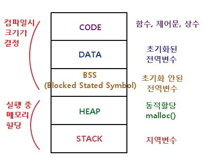

# 1. 메모리 구조



# 2. 데이터 영역

1. 전역, static 변수가 저장됨(rw 영역)
2. 초기화 되지 않으면 bss영역에 저장
3. 프로그램이 종료되면 반환

# 3. 스택 영역

1. 일반적인 변수가 저장되며 함수 블록 단위로 저장
2. 하나의 블록은 인자, 일반변수, 리턴값으로 저장
3. 함수가 종료되면 LIFO로 함수 블록이 반환
4. 런타임 시간에 크기 변경 불가

# 4. 힙 영역

1. 동적 메모리 영역
2. 할당 후 해제가 반드시 필요함
3. 읽고 쓰는 속도가 스택에 비해 약간 느림

# 5. 메모리 관리 방법

1. 일반 적인 경우 스마트 포인터를 사용

   - delete를 해주지 않아도 자동으로 메모리 해제됨

2. 배열 형태 사용 필요시 vector를 사용

# 6. 메모리 누수 찾는 방법(팁)

1. valgrind 프로그램명

# 7. 언제 스택? 힙?

1. 데이터량이 mb 이하이면 스택(array 사용)

```cpp
std::array<int, 1000> ar;
```

2. 데이터량이 mb 이상이면 힙(vector 사용)

```cpp
std::vector<cat, 1000000> ve;
```

3. 왜?

- 스택은 위에서부터 그냥 쌓기 때문에 힙보다 빠름

# 참고

[코드없는 프로그래밍(유투브)](https://www.youtube.com/channel/UCHcG02L6TSS-StkSbqVy6Fg)
