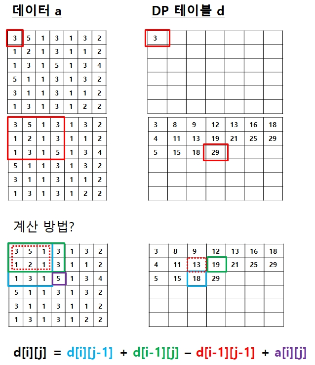
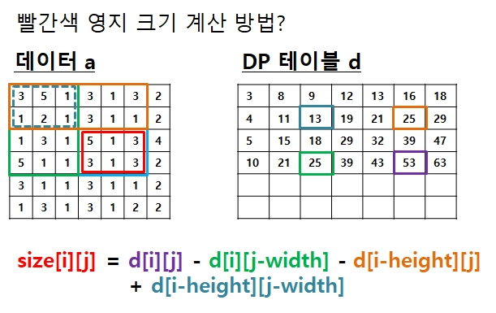

# 0. 문제

세종대왕은 현수에게 현수가 다스릴 수 있는 영지를 하사하기로 했다. 전체 땅은 사각형으로 표시된다. 그 사각형의 땅 중에서 세종대왕이 현수가 다스릴 수 있는 땅의 크기(세로의 길이와 가
로의 길이)를 정해주면 전체 땅 중에서 그 크기의 땅의 위치를 현수가 정하면 되는 것이다.  
전체 땅은 사각형의 모양의 격자로 되어 있으며, 그 사각형 땅 안에는 많은 오렌지 나무가 심겨져 있다. 현수는 오렌지를 무척 좋아하여 오렌지 나무가 가장 많이 포함되는 지역을 선택하고 싶어 한다. 현수가 얻을 수 있는 영지의 오렌지 나무 최대 개수를 출력하는 프로그램을 작성하세요. 다음과 같은 땅의 정보가 주어지고, 현수가 하사받을 크기가, 가로 2, 세로 3의 크기이면 가장 많은 오렌지 나무가 있는 영지는 총 오렌지 나무의 개수가 16인 3행 4열부터 시작하는 구역이다.

1. 입력설명

   - 첫 줄에 H(세로길이)와 W(가로길이)가 입력된다. (5<=H, W<=50) 그 다음 H줄에 걸쳐 각 사각형 지역에 오렌지의 나무 개수(1~9개) 정보가 주어진다.
   - 그 다음 영지의 크기인 세로길이(1~H)와 가로길이(1~W)가 차례로 입력된다.

2) 출력 설명

   - 첫 줄에 현수가 얻을 수 있는 오렌지 나무의 최대 개수를 출력한다.

3) 입력 예제1

   - 6 7
   - 3 5 1 3 1 3 2
   - 1 2 1 3 1 1 2
   - 1 3 1 5 1 3 4
   - 5 1 1 3 1 3 2
   - 3 1 1 3 1 1 2
   - 1 3 1 3 1 2 2
   - 2 3

4. 출력 예제1

   - 16

5. 문제 풀이 핵심
   - DP 테이블을 구한다.
   - DP 테이블을 이용해 면적을 계산한다.

# 1. 풀이1 : DP 테이블을 구한다.

1. DP 테이블을 구함
   - i,j 번째 DP 테이블은 아래와 같이 구할 수 있다.
     
2. DP 테이블을 이용하여 영지크기를 계산한다.
   - i,j 번째 영지 크기는 아래와 같이 구할 수 있다.
     

```cpp
#include<vector>
#include<algorithm>
using namespace std;

int a[701][701], dy[701][701];
int main() {
	int h, w, n, m, i, j, tmp, max = -2147000000;
	scanf_s("%d %d", &h, &w);
	for (i = 1; i <= h; i++) {
		for (j = 1; j <= w; j++) {
			scanf_s("%d", &a[i][j]);
			dy[i][j] = dy[i - 1][j] + dy[i][j - 1] - dy[i - 1][j - 1] + a[i][j];
		}
	}

	scanf_s("%d %d", &n, &m);
	for (i = n; i <= h; i++) {
		for (j = m; j <= w; j++) {
			tmp = dy[i][j] - dy[i - n][j] - dy[i][j - m] + dy[i - n][j - m];
			if (tmp > max) max = tmp;
		}
	}
	printf("%d\n", max);
	return 0;
}
```

# 참고

1. [it 취업을 위한 알고리즘 문제풀이 (with C/C++) : 코딩테스트 대비](https://www.inflearn.com/course/%EC%95%8C%EA%B3%A0%EB%A6%AC%EC%A6%98/)
