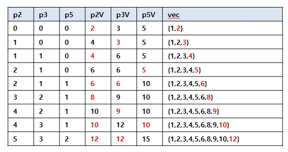

# 0. 문제

어떤 수를 소인수분해 했을 때 그 소인수가 2 또는 3 또는 5로만 이루어진 수를 Ugly Number라고 부릅니다. Ugly Number를 차례대로 적어보면  
 1, 2, 3, 4, 5, 6, 8, 9, 10, 12, 15, .......입니다. 숫자 1은 Ugly Number의 첫 번째 수로 합 니다. 자연수 N이 주어지면 Ugly Number를 차례로 적을 때 N번째 Ugly Number를 구하는 프로그램을 작성하세요.

1. 입력설명

   - 첫 줄에 자연수 N(3<=N<=1500)이 주어집니다.

2. 출력 설명

   - 첫 줄에 N번째 Ugly Number를 출력하세요.

3. 입력 예제1

   - 10

4. 출력 예제1

   - 12

5. 입력 예제2
   - 1500
6. 출력 예제2
   - 859963392
7. 문제 풀이 핵심
   - vector(또는 배열)에 ugly number를 순서대로 입력 한다.
   - ugly number는 2,3,5를 이용해 작은 값 순서대로 입력한다.

# 1. 풀이1 : vector에 ugly number를 순서대로 입력한다.

1. p2,p3,p5 변수를 생성하여 vector의 제일 앞을 가리킨다.
   - p2,p3,p5 는 각각 vector를 가리키는 인덱스 값
2. p2,p3,p5 가 각각 가리키는 값을 곱하여 최소값을 구한다.
   - p2V = vector[p2] \* 2 : p2가 가리키는 uglynumber에 2를 곱함
   - p3V = vector[p3] \* 3 : p3가 가리키는 uglynumber에 3를 곱함
   - p5V = vector[p5] \* 2 : p5가 가리키는 uglynumber에 5를 곱함
3. p2V, p3V, p5V의 최소값을 vector에 넣는다.
4. 최소값을 가리키는 인덱스는 1증가한다.
   - 만약 p2V가 가장 작으면, p2 에 +1을 한다.
   - 만약 여러 개(p2V,p3V 등) 이 동시에 가장 작으면 , p2,p3에 +1을 한다.
5. 최종적으로 입력받은 number에 해당하는 vector값을 출력한다.

```cpp
#include<iostream>
#include<vector>
int p2 = 0, p3 = 0, p5 = 0;
int p2V, p3V, p5V;
std::vector<int> vecData;

// 최소값 구하기
int findMin() {
	int min = 0;
	p2V = vecData[p2] * 2;
	p3V = vecData[p3] * 3;
	p5V = vecData[p5] * 5;

	if (p2V <= p3V) {
		if (p2V <= p5V) {
			min = p2V;
		}
		else {
			min = p5V;
		}
	}
	else {
		if (p3V <= p5V) {
			min = p3V;
		}
		else {
			min = p5V;
		}
	}
	return min;
}

int main() {
	int n;
	scanf_s("%d", &n);
	int data;
	vecData.push_back(1);
	for (int i = 1; i < n; i++) {
		int min = findMin();
		if (min >= p2V) {
			p2++;
			data = p2V;
		}
		if (min >= p3V) {
			p3++;
			data = p3V;
		}
		if (min >= p5V) {
			p5++;
			data = p5V;

		}
		vecData.push_back(data);
	}
	std::cout << vecData.back() << std::endl;
	return 0;
}
```

6. 예시
   

# 참고

1. [it 취업을 위한 알고리즘 문제풀이 (with C/C++) : 코딩테스트 대비](https://www.inflearn.com/course/%EC%95%8C%EA%B3%A0%EB%A6%AC%EC%A6%98/)
