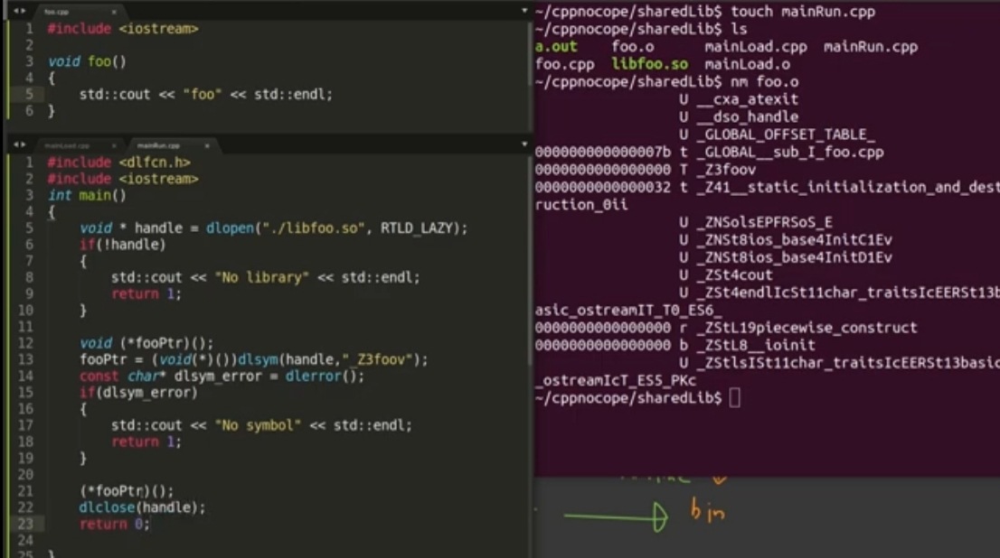

# 1. extern vs static

1. 링크의 방향을 결정(외부 또는 외부)
2. extern int a
   - 다른 파일의 전역 변수 a를 사용함
3. extern void func()
   - 함수는 기본값이 extern(생략되어 있음)
4. static int a
   - 다른 파일에서 a를 찾을 수 없음
5. static void bar()
   - 파일 내부에서만 호출 가능한 함수

# 2. gcc debug

1. 컴파일

```cmd
gcc main.cpp -g
```

2. gdb 실행

```cmd
gdb main.out
```

3. 디버깅 시작

   - start 입력

4. 다음 줄 실행

   - next 입력

5. 뷰어 제공
   - ctrl + x + a
   - n : 다음 줄 이동
   - break 26 : 26번줄 브레이크 적용
   - break 함수이름 : 함수 첫 호출에 브레이크 적용
   - continue : 브레이크 포인터에서 멈춤
   - step : 함수 안으로 들어감
   - print 변수명: 변수 정보 출력
   - bt : 콜 스택을 보여줌

# 3. static library

1. 오브젝트 파일들을 모아 하나의 파일로 생성한 것
2. 이름은 lib이름.a 형태
3. 링킹 시점에 실행파일에 바인딩 된다.

# 4. Dynamic library

1. 이름은 lib이름.so 형태
2. 빌드시 -fPIC 옵션 줘야함
   - 여러 프로그램에서 콜 될 수 있도록 생성시 주소를 상대주소로 설정
3. loadtime에 바인딩 하는 방법
   
4. runtime에 바인딩 하는 방법
   
