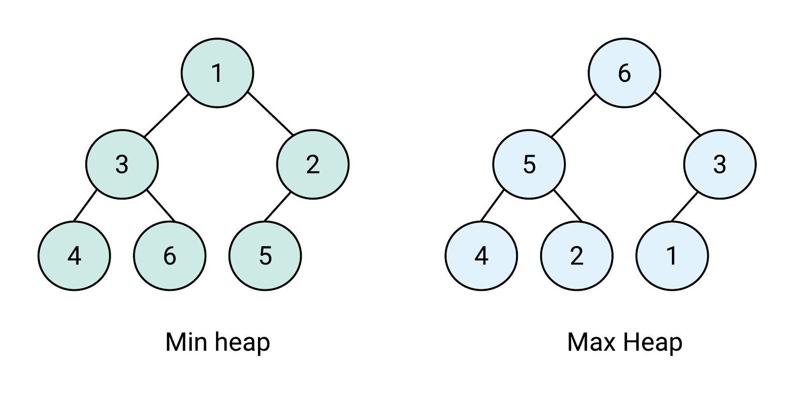

# 0. 정렬 알고리즘

1. 변경 알고리즘의 특수한 형태
2. 특정 정렬 기준으로 원소의 순서를 변경 및 정렬

# 1. 정렬 알고리즘 리스트

| 알고리즘                         | 설명                                                                                          |
| -------------------------------- | --------------------------------------------------------------------------------------------- |
| make_heap(b,e)                   | 힙을 생성. 구간 [b,e)의 순차열을 힙 구조로 변경                                               |
| make_heap(b,e,f)                 | make_heap(b,e)와 동일. f는 조건자로 비교에 사용.                                              |
| push_heap(b,e)                   | 힙에 원소 추가. push_back와 같이 사용. 구간 [b,e)의 순차열을 다시 힘 구조가 되게 함.          |
| push_heap(b,e,f)                 | push_heap(b,e)와 동일. f는 조건자로 비교에 사용                                               |
| pop_heap(b,e)                    | 힙에서 원소 제거. 구간 [b,e)의 순차열의 가장 큰 원소(첫 원소)를 제거.                         |
| pop_heap(b,e,f)                  | pop_heap(b,e)와 동일. f는 조건자로 비교에 사용.                                               |
| sort_heap(b,e)                   | 힙을 정렬. 구간 [b,e)의 순차열을 힙 구조를 이용해 정렬                                        |
| sort_heap(b,e,f)                 | sort_heap(b,e)와 동일. f는 조건자로 비교에 사용                                               |
| nth_element(b,m,e)               | 구간 [b,e)의 원소 중 m-b개 만큼 선별된 원소를 [b,m) 순차열에 놓이게 함                        |
| nth_element(b,m,e,f)             | nth_element(b,m,e) 와 동일. f는 조건자로 비교에 사용                                          |
| sort(b,e)                        | 구간 [b,e)를 퀵 정렬 기반으로 정렬                                                            |
| sort(b,e,f)                      | sort(b,e) 와 동일. 조건자 f를 사용해 정렬.                                                    |
| stable_sort(b,e)                 | 구간 [b,e)를 머지 정렬을 기반으로 정렬. 값이 같은 원소의 상대적 순서 유지.                    |
| stable_sort(b,e,f)               | stable_sort(b,e)와 동일. f는 조건자로 비교에 사용.                                            |
| partial_sort(b,m,e)              | 힙 정렬 기반으로 정렬. 구간 [b,e) 원소 중 m-b개 만큼 상위 원소를 정렬하여 [b,m) 순차열에 놓음 |
| partial_sort(b,m,e,f)            | partial_sort(b,m,e) 와 동일. f는 조건자로 비교에 사용.                                        |
| partial \_sort_copy(b,e,b2,e2)   | 힙 정렬 기반으로 정렬. 구간 [b,e) 원소 중 상위 e2-b2개의 원소만 정렬하여 [b2,e2)로 복사       |
| partial \_sort_copy(b,e,b2,e2,f) | partial \_sort_copy(b,e,b2,e2)와 동일. f는 조건자로 비교에 사용.                              |

# 2.힙 관련 알고리즘

1. 자료 구조 힙
   - 완전 이진 트리로 구성
   - 트리 내의 모든 원소가 부모 노드보다 큰 값(또는 작은 값)을 가짐
   - 루트 노드는 항상 가장 작은 값(또는 가장 큰 값)을 가짐
   - 최대값, 최소값 연산이 빠름
2. 힙의 연산
   - 추가 연산
   - => 완전 이진 트리 가장 끝에 원소 추가
   - => 힙의 규칙을 깨지 않게 교환하여 힙을 유지
   - 제거 연산
   - => 루트 노드를 삭제
   - => 삭제된 루트 노드에 힙의 마지막 노드 가져옴
   - => 힙의 규칙 깨지 않게 교환하여 힙을 유지
3. heap 예제
   - min heap : v = {1,3,2,4,6,5}
   - max heap : v = {6,5,3,4,2,1}
     
4. make_heap(b,e)
   - 구간 [b,e)의 순차열을 힙 구조로 만듦

```cpp
vector<int> v = {10,20,30,40,50,60};
// 1. 최대 heap 생성
make_heap(v.begin(), v.end());
// v = {60,50,30,40,20,10}

// 2. 최소 heap 생성
make_heap(v.begin(), v.end(), greater<int>());
// v= {10,20,50,30,40,60}
```

5. push_heap(b,e)
   - 원소가 추가된 상태에서 사용
   - 추가된 구간 [b,e) heap을 교환하여 heap을 유지함.
   - 일반적으로 push_back()과 함께 사용

```cpp
//위의 예제 수행 후
v.push_back(35);
// 마지막에 단순 원소 추가
// v = {60,50,30,40,20,10,35}
push_heap(v.begin(), v.end());
// v = {60,50,35,40,20,10,30}
// heap 형태를 재계산
```

6. pop_heap(b,e)
   - root node를 (논리적)제거(제일 마지막으로 이동)
   - 원리
   - 1)root node와 마지막 node를 교환
   - 2)heap을 유지하도록 교환 반복

```cpp
vector<int> v = {10,20,30,40,50,60};
make_heap(v.begin(), v.end());
// v = {60,50,30,40,20,10}
pop_hep(v.begin(), v.end());
// v= {50,40,30,10,20,60}
```

7. sort_heap(b,e)
   - 구간 [b,e)를 heap 정렬
   - 구간 [b,e)가 heap 구조여야 함

```cpp
vector<int> v = {10,20,30,40,50,60};
make_heap(v.begin(), v.end());
// v = {60,50,30,40,20,10}
sort_heap(v.begin(), v.end());
// v= {10,20,30,40,50,60}
```

# 3. 기타 정렬 알고리즘 상세

1. nth_element(b,m,e)
   - 전체 구간 [b,e) 에서 구간 [b,m) 만큼의 순차열을 부분적으로 정렬
   - 주로 n 개의 요소를 선별할 때 사용
   - 또는 n 번째 요소가 필요할 때 사용

```cpp
vector<int> v = {10,30,20,40,50,60};
nth_element(v.begin(), v.begin() + 1, v.end());
// 두번째로 작은 값 : v[1] = 20
```

2. sort(b,e)
   - 퀵 정렬을 기반으로 정렬

```cpp
vector<int> v = {5,1,3,2,7,9,8};
//오름차순 정렬(less: defualt)
sort(v.begin(), v.end());
// v = {1,2,3,5,7,8,9}

//내림차순 정렬(greater)
sort(v.begin(), v.end(), greater<int>());
// v = {9,8,7,5,3,2,1}
```

3. stable_sort(b,e)
   - 머지 정렬을 기반으로 정렬
   - 같은 원소의 상대적인 순서를 유지할 때 사용

```cpp
vector<int> v= {30,50,30,20,40,10,40};
//오름차순 정렬(less: defualt)
stable_sort(v.begin(), v.end());
// v = {10,20,30,30,40,40,50}

//내림차순 정렬(greater)
stable_sort(v.begin(), v.end(), greater<int>());
// v = {50,40,40,30,30,20,10}
```

4. partial_sort(b,m,e)
   - heap정렬 기반으로 정렬
   - 순차열의 상위 구간만 정렬할 때 사용
   - heap정렬의 특징이 필요할 때 사용
   - m과 e가 같다면 전체 원소를 정렬함

```cpp
vector<int> v = {10,30,20,40,50,60};
partial_sort(v.begin(), v.begin() + 3, v.end());
// v.begin() 부터 3개까지만 heap 정렬함
// v = {10,20,30,40,50,60}
```

5. partial \_sort_copy(b,e,b2,e2)
   - 구간 [b,e) 를 heap정렬 하고,
   - 구간 [b2,e2)에 정렬 결과를 저장함.

```cpp
vector<int> v = {10,30,20,40,50,60};
vector<int> v2(3);
partial_sort_copy(v.begin(), v.end(), v2.begin(), v2.end());
// v.begin() 부터 3개까지만 heap 정렬함
// v2 = {10,20,30}
```

# 참고

1. 뇌를 자극하는 C++ STL
2. https://velog.io/@nninnnin7/HEAP
