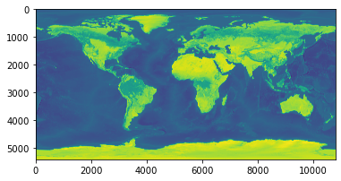
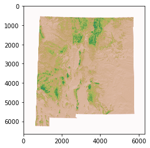
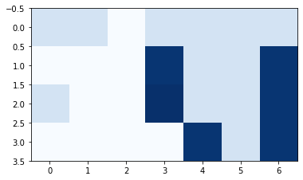

# 1. Rasterio로 래스터 데이터 읽고 쓰기

- **Rasterio로 파일 읽기**

```python
import rasterio
dataset = rasterio.open(r'Natural_Earth_quick_start\50m_raster\NE1_50M_SR_W\NE1_50M_SR_W.tif')
```

- **밴드 수 확인**

```python
dataset.count
```

```text
3
```

- **열 수(width) 조회**

```python
dataset.width
```

```text
10800
```

- **높이(height) 조회**

```python
dataset.height
```

```text
5400
```

- **공간 경계(boundbox) 조회**

```python
dataset.bounds
```

```text
BoundingBox(left=-179.99999999999997, bottom=-89.99999999998201, right=179.99999999996405, top=90.0)
```

- **CRS 조회**

```python
dataset.crs
```

```text
CRS.from_epsg(4326)
```

- **밴드1 데이터 조회**

```python
band1 = dataset.read(1)
```

- **이미지 보기**

```python
%matplotlib inline
from matplotlib import pyplot
pyplot.imshow(dataset.read(1))
pyplot.show()
```



# 2. GDAL로 래스터 데이터 읽고 쓰기

# 2.1 터미널에서 GDAL 명령 수행하기

- 터미널 명령어 이며, 상기 내용 처럼 !를 포함하면 JupyterNoteBook에서 명령 가능하다.
- **지원되는 모든 파일 형식 조회**

```python
!gdalinfo --formats
```

```text
Supported Formats:
  VRT -raster- (rw+v): Virtual Raster
...
```

- **파일 정보 요약(CRS 포함)**

```python
!gdalinfo "Natural_Earth_quick_start\50m_raster\NE1_50M_SR_W\NE1_50M_SR_W.tif"
```

```text
Driver: GTiff/GeoTIFF
Files: Natural_Earth_quick_start\50m_raster\NE1_50M_SR_W\NE1_50M_SR_W.tif
Size is 10800, 5400
Coordinate System is:
GEOGCRS["WGS 84",
    DATUM["World Geodetic System 1984",
        ELLIPSOID["WGS 84",6378137,298.257223563,
            LENGTHUNIT["metre",1]]],
    PRIMEM["Greenwich",0,
        ANGLEUNIT["degree",0.0174532925199433]],
    CS[ellipsoidal,2],
        AXIS["geodetic latitude (Lat)",north,
            ORDER[1],
            ANGLEUNIT["degree",0.0174532925199433]],
        AXIS["geodetic longitude (Lon)",east,
            ORDER[2],
            ANGLEUNIT["degree",0.0174532925199433]],
    USAGE[
        SCOPE["unknown"],
        AREA["World"],
        BBOX[-90,-180,90,180]],
    ID["EPSG",4326]]
Data axis to CRS axis mapping: 2,1
Origin = (-179.999999999999972,90.000000000000000)
Pixel Size = (0.033333333333330,-0.033333333333330)
Metadata:
  AREA_OR_POINT=Area
  TIFFTAG_DATETIME=2014:10:18 09:32:38
  TIFFTAG_RESOLUTIONUNIT=2 (pixels/inch)
  TIFFTAG_SOFTWARE=Adobe Photoshop CC 2014 (Macintosh)
  TIFFTAG_XRESOLUTION=342.85699
  TIFFTAG_YRESOLUTION=342.85699
Image Structure Metadata:
  INTERLEAVE=PIXEL
Corner Coordinates:
Upper Left  (-180.0000000,  90.0000000) (180d 0' 0.00"W, 90d 0' 0.00"N)
Lower Left  (-180.0000000, -90.0000000) (180d 0' 0.00"W, 90d 0' 0.00"S)
Upper Right ( 180.0000000,  90.0000000) (180d 0' 0.00"E, 90d 0' 0.00"N)
Lower Right ( 180.0000000, -90.0000000) (180d 0' 0.00"E, 90d 0' 0.00"S)
Center      (  -0.0000000,   0.0000000) (  0d 0' 0.00"W,  0d 0' 0.00"N)
Band 1 Block=10800x1 Type=Byte, ColorInterp=Red
Band 2 Block=10800x1 Type=Byte, ColorInterp=Green
Band 3 Block=10800x1 Type=Byte, ColorInterp=Blue
```

- **GeoTiff를 JPEG로 변환**

```python
!gdal_translate -of JPEG "Natural_Earth_quick_start\50m_raster\NE1_50M_SR_W\NE1_50M_SR_W.tif" NE1_50M_SR_W.jpg
```

```text
Input file size is 10800, 5400
0...10...20...30...40...50...60...70...80...90...100 - done.
```

- **GDAL을 사용해 GeoPackage 파일 정보 보기**
  - [Sample 파일 다운로드](http://geopackage.org/data/gdal_sample_v1.2_no_extensions.gpkg)

```python
!gdalinfo gdal_sample_v1.2_no_extensions.gpkg
```

```text
Driver: GPKG/GeoPackage
Files: gdal_sample_v1.2_no_extensions.gpkg
Size is 512, 512
Subdatasets:
  SUBDATASET_1_NAME=GPKG:gdal_sample_v1.2_no_extensions.gpkg:byte_png
  SUBDATASET_1_DESC=byte_png - byte_png
  SUBDATASET_2_NAME=GPKG:gdal_sample_v1.2_no_extensions.gpkg:byte_jpeg
  SUBDATASET_2_DESC=byte_jpeg - byte_jpeg
Corner Coordinates:
Upper Left  (    0.0,    0.0)
Lower Left  (    0.0,  512.0)
Upper Right (  512.0,    0.0)
Lower Right (  512.0,  512.0)
Center      (  256.0,  256.0)
```

# 2.2 GDAL 라이브러리 사용

# 2.2.1 GDAL 읽기/쓰기/투영 확인/변경

- [sample 데이터](https://rgis.unm.edu/rgis6/)에서 New Mexico Color Shaded Relief 데이터 다운
- **데이터 읽기**

```python
from osgeo import gdal
nmtif = gdal.Open(r'Data/nm_relief_color_tif/nm_relief_color.tif')
print(nmtif.GetMetadata())
```

```text
{'AREA_OR_POINT': 'Area', 'TIFFTAG_DATETIME': '2002:12:18  8:10:06', 'TIFFTAG_RESOLUTIONUNIT': '2 (pixels/inch)', 'TIFFTAG_SOFTWARE': 'IMAGINE TIFF Support\nCopyright 1991 - 1999 by ERDAS, Inc. All Rights Reserved\n@(#)$RCSfile: etif.c $ $Revision: 1.9.3.3 $ $Date: 2002/07/29 15:51:11EDT $', 'TIFFTAG_XRESOLUTION': '96', 'TIFFTAG_YRESOLUTION': '96'}
```

- **투영 정보 확인**

```python
nmtif.GetProjection()
```

```text
'PROJCS["NAD83 / UTM zone 13N",GEOGCS["NAD83",DATUM["North_American_Datum_1983",SPHEROID["GRS 1980",6378137,298.257222101,AUTHORITY["EPSG","7019"]],TOWGS84[0,0,0,0,0,0,0],AUTHORITY["EPSG","6269"]],PRIMEM["Greenwich",0,AUTHORITY["EPSG","8901"]],UNIT["degree",0.0174532925199433,AUTHORITY["EPSG","9122"]],AUTHORITY["EPSG","4269"]],PROJECTION["Transverse_Mercator"],PARAMETER["latitude_of_origin",0],PARAMETER["central_meridian",-105],PARAMETER["scale_factor",0.9996],PARAMETER["false_easting",500000],PARAMETER["false_northing",0],UNIT["metre",1,AUTHORITY["EPSG","9001"]],AXIS["Easting",EAST],AXIS["Northing",NORTH],AUTHORITY["EPSG","26913"]]'
```

- **투영 변경 하기**

```python
from osgeo import osr
p = osr.SpatialReference()
p.ImportFromEPSG(26913)
nmtif.SetProjection(p.ExportToWkt())
```

- **새 TIF 파일로 저장**

```python
geoTiffDriver = "GTiff"
driver=gdal.GetDriverByName(geoTiffDriver)
out = driver.CreateCopy('copy.tif', nmtif, strict = 0)
```

# 2.2.2 데이터 다루기

- **밴드 개수 구하기**

```python
nmtif.RasterCount
```

```text
3
```

- **1번 밴드 데이터 보기**

```python
band = nmtif.GetRasterBand(1)
values = band.ReadAsArray()
values
```

```text
array([[254, 255, 255, ..., 250, 249, 247],
       [255, 255, 255, ..., 251, 250, 249],
       [255, 255, 255, ..., 252, 250, 249],
       ...,
       [255, 255, 255, ..., 255, 255, 254],
       [255, 255, 255, ..., 254, 253, 253],
       [255, 255, 255, ..., 252, 251, 251]], dtype=uint8)
```

```python
values[1100,1100]
```

```text
216
```

- **특정 픽셀 컬러값 구하기**

```python
one = nmtif.GetRasterBand(1).ReadAsArray()
two = nmtif.GetRasterBand(2).ReadAsArray()
three = nmtif.GetRasterBand(3).ReadAsArray()
print(str(one[1100,1100]) + "," + str(two[1100,1100]) + "," + str(three[1100,1100]))
```

```text
216,189,157
```

- **특정 band 평균, 표준편차 얻기**

```python
one = nmtif.GetRasterBand(1)
one.ComputeBandStats()
```

```text
(225.05771967375847, 34.08382839593031)
```

- **특정 band 최대/최소값 구하기**

```python
print("최대값 = ", str(one.GetMaximum()))
print("최소값 = ", str(one.GetMinimum()))
```

```text
최대값 =  255.0
최소값 =  0.0
```

- **특정 band의 description 확인/변경**

```python
print("변경 전 = ", str(one.GetDescription()))
one.SetDescription("The Red Band")
print("변경 후 = ", str(one.GetDescription()))
```

```text
변경 전 =  Band_1
변경 후 =  The Red Band
```

- **Jupyter Notebook에서 래스터 파일 보기**

```python
import numpy as np
from matplotlib.pyplot import imshow
%matplotlib inline
data_array=nmtif.ReadAsArray()
x=np.array(data_array[0])
image = x.reshape(x.shape[0], x.shape[1])
imshow(image, cmap='gist_earth')
```



# 2.2.3 GDAL을 이용한 래스터 생성

- **Sample Data 생성**
  - numpy array 이용

```python
raster = np.array([[10,10,1,10,10,10,10],
                  [1,1,1,50,10,10,50],
                 [10,1,1,51,10,10,50],
                 [1,1,1,1,50,10,50]])
raster
```

```text
array([[10, 10,  1, 10, 10, 10, 10],
       [ 1,  1,  1, 50, 10, 10, 50],
       [10,  1,  1, 51, 10, 10, 50],
       [ 1,  1,  1,  1, 50, 10, 50]])
```

- **래스터 파일 속성 설정**

```python
# 좌하단 모서리 좌표 설정
coord=(-106,629773, 35.105389)

# 폭 , 높이 설정
w, h = 10, 10

# 파일명 설정
name = "new.tif"
```

- **래스터 파일에 쓰기**

```python
# 1. driver 가져오기
d=gdal.GetDriverByName("GTiff")

# 2. file 설정
rows = raster.shape[0]
cols = raster.shape[1]
numOfBands = 1
output = d.Create(name, cols, rows, numOfBands, gdal.GDT_UInt16)
output.SetGeoTransform((coord[0], w, 0, coord[1], 0 ,h))

# 3. 데이터 쓰기
output.GetRasterBand(1).WriteArray(raster)

# 4. 좌표계 설정
outsr = osr.SpatialReference()
outsr.ImportFromEPSG(4326)
output.SetProjection(outsr.ExportToWkt())

# 5. 파일에 쓰기
output.FlushCache()
```

- **결과 확인**

```python
data = output.ReadAsArray()
w,h = 4,7
image = data.reshape(w,h)
imshow(image, cmap='Blues')
data
```

```text

array([[10, 10,  1, 10, 10, 10, 10],
       [ 1,  1,  1, 50, 10, 10, 50],
       [10,  1,  1, 51, 10, 10, 50],
       [ 1,  1,  1,  1, 50, 10, 50]], dtype=uint16)
```



# \# 참고

- 파이썬을 활용한 지리공간 분석 마스터하기
- [GDAL, OGR CookBook](https://pcjericks.github.io/py-gdalogr-cookbook/index.html)
