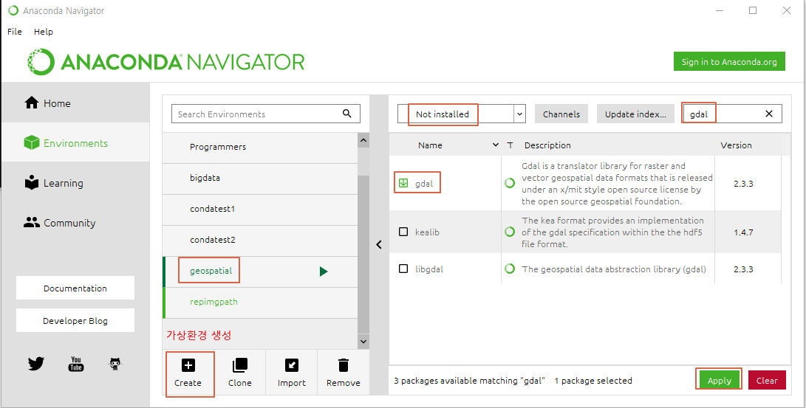

## 1\. GDAL/OGR

- GDAL 과 OGR 이란?
  - GDAL(Geospatial Data Abstraction Library : 래스터 데이터 처리에 많이 사용하는 라이브러리
  - OGR : 벡터 포맷 데이터 처리에 많이 사용하는 라이브러리
- GDAL 설치 하기
  - 아나콘다 내비게이터를 이용해 설치
    - 가상 환경 생성
    - 생성된 가상환경에 Not installed 설정 -> gdal 검색하여 체크 -> Apply
    - 
  - 아나콘다 프롬프트를 이용해 설치
    - 가상 환경 생성

```python
conda create -n geospatial
activate geospatial
conda install gdal
```

## 2\. GEOS(Geometry Engine Open Source)

- GEOS란?
  - JTS(Java Topology Suite)의 서브셋과 선택된 기능의 C/C++ 포트
  - JTS의 완전한 기능을 C++로 포함하는 것을 목표
  - QGIS, PostGIS 등 여러 어플리케이션에서 사용됨
  - GDAL과 함께 컴파일해서 OGR의 모든 기능을 제공
- JTS란?
  - Java로 작성된 지리공간 지오메트리 라이브러리
- GEOS 설치하기

```python
conda install -c conda-forge geos
```

## 3\. Shapely

- Shapely란?
  - 평면 형상의 처리와 분석을 위한 파이썬 패키지
  - GEOS 라이브러리 및 JTS 포트의 기능을 사용함
  - 지오메트리 분석만 다룸(공간 파일을 읽고 쓸 수 있는 기능 없음)
  - 8가지 기본 지오메트리 타입 지원
    - 포인트, 멀티 포인트, 멀티 라인 스트링, 멀티 폴리곤, 폴리곤, 다원형, 지오메트리 컬렉션
  - OGR보다 더 파이썬에 가깝고 직관적인 인터페이스, 최적화가 잘 되어 있음
- Shapely 설치하기

```python
conda install -c scitools shapely
```

## 4\. Fiona

- Fiona란?
  - OGR API로 데이터 포맷을 읽고 쓰는데 사용
  - OGR 보다 파이썬에 가깝고 신뢰성이 높고 오류 발생률이 낮아 OGR대신 사용
  - 벡터 데이터에 관한 공간 정보를 표현하기 위해 WKT와 WKB라는 두 개의 마크업 언어 사용
  - Shapely와 같은 다른 파이썬 라이브러리와 잘 결합됨
  - 벡터 데이터 복사 시 메모리를 많이 사용(C의 포인터가 아니라 파이썬의 오브젝트 사용하기 때문)
- Fiona 설치

```python
conda install -c conda-forge fiona
```

## 5\. pyshp

- pyshp(Python Shapefile Library) 란?
  - Shape File을 다루기 위한 파이썬 라이브러리
  - Shape File만 다룬다면 GDAL을 쓰는 것 보다 pyshp을 사용하는 것을 추천
- pyshp 설치

```python
conda install pyshp
```

## 6\. pyproj

- pyproj 란?
  - 도표 변환과 측지 연산을 수행하는 파이썬 패키지
  - PROJ.4 함수에 파이썬 인터페이스를 제공하기 위한 Cython 래퍼로 파이썬에서 기존 C코드 라이브러리에 직접 접근 가능
- PROJ.4 란?
  - 여러 좌표계 중에서 데이터를 변환하는 투영 라이브러리
  - GDAL과 OGR에서도 이용 가능
  - 인기 있는 이유
    - 다양한 좌표계를 지원
    - Rasterio, GeoPandas 라이브러리 모두 pyproj를 사용하고, 그에 따라 PROJ.4 기능을 사용함
- pyproj 설치

```python
conda install -c conda-forge pyproj
```

## 7\. Rasterio

- Rasterio 란?
  - 래스터 데이터를 위한 GDAL 및 Numpy 기반 파이썬 라이브러리
  - Web과 App을 위한 온라인 지도 제공업체 맵박스 위성팀에서 제공하는 오픈소스
- Rasterio 설치

```python
conda config --add channels conda-forge
conda install rasterio
```

## 8\. GeoPandas

- GeoPandas 란?
  - 벡터 데이터 작업을 위한 파이썬 라이브러리
  - pandas와 유사하고 공간 데이터 처리에 유용하게 사용됨
- GeoPandas 설치

```python
conda install -c conda-forge geopandas
```

## \# 참고

- 파이썬을 활용한 지리 공간 분석 마스터하기
