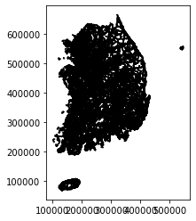
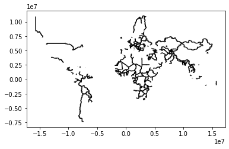
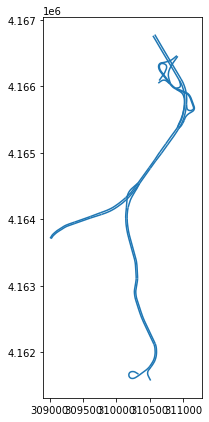
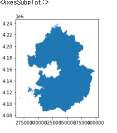

# 1. 데이터 읽기

- **벡터 데이터 읽기**
  - read_file(\*.shp) : shp파일 읽어서 geoDataFrame에 저장

```python
import geopandas as gpd
df = gpd.read_file(r'data/MOCT_LINK.shp',encoding='CP949')
df.head()
```

<div style="overflow-x:scroll; ">
<style scoped>
    .dataframe tbody tr th:only-of-type {
        vertical-align: middle;
         white-space: nowrap !important;
    }

    .dataframe tbody tr th {
        vertical-align: top;
         white-space: nowrap !important;
    }

    .dataframe thead th {
        text-align: right;
         white-space: nowrap !important;
    }

</style>
<table border="1" class="dataframe">
  <thead>
    <tr style="text-align: right;">
      <th></th>
      <th>LINK_ID</th>
      <th>F_NODE</th>
      <th>T_NODE</th>
      <th>LANES</th>
      <th>ROAD_RANK</th>
      <th>ROAD_TYPE</th>
      <th>ROAD_NO</th>
      <th>ROAD_NAME</th>
      <th>ROAD_USE</th>
      <th>MULTI_LINK</th>
      <th>CONNECT</th>
      <th>MAX_SPD</th>
      <th>REST_VEH</th>
      <th>REST_W</th>
      <th>REST_H</th>
      <th>LENGTH</th>
      <th>REMARK</th>
      <th>geometry</th>
    </tr>
  </thead>
  <tbody>
    <tr>
      <th>0</th>
      <td>2630193301</td>
      <td>2630076801</td>
      <td>2630076901</td>
      <td>1</td>
      <td>106</td>
      <td>000</td>
      <td>391</td>
      <td>화악산로</td>
      <td>0</td>
      <td>0</td>
      <td>000</td>
      <td>60</td>
      <td>0</td>
      <td>0.0</td>
      <td>0</td>
      <td>1410.192910</td>
      <td>None</td>
      <td>LINESTRING (245889.208 602540.103, 245884.524 ...</td>
    </tr>
    <tr>
      <th>1</th>
      <td>2630193001</td>
      <td>2630076801</td>
      <td>2630076701</td>
      <td>1</td>
      <td>106</td>
      <td>003</td>
      <td>391</td>
      <td>화악산로</td>
      <td>0</td>
      <td>0</td>
      <td>000</td>
      <td>60</td>
      <td>0</td>
      <td>0.0</td>
      <td>0</td>
      <td>12.137670</td>
      <td>None</td>
      <td>LINESTRING (245881.843 602537.719, 245885.114 ...</td>
    </tr>
    <tr>
      <th>2</th>
      <td>2630193101</td>
      <td>2630076701</td>
      <td>2630076801</td>
      <td>1</td>
      <td>106</td>
      <td>003</td>
      <td>391</td>
      <td>화악산로</td>
      <td>0</td>
      <td>0</td>
      <td>000</td>
      <td>60</td>
      <td>0</td>
      <td>0.0</td>
      <td>0</td>
      <td>12.326808</td>
      <td>None</td>
      <td>LINESTRING (245893.460 602528.496, 245889.209 ...</td>
    </tr>
    <tr>
      <th>3</th>
      <td>2630192801</td>
      <td>2630076701</td>
      <td>2630076601</td>
      <td>1</td>
      <td>106</td>
      <td>000</td>
      <td>391</td>
      <td>화악산로</td>
      <td>0</td>
      <td>0</td>
      <td>000</td>
      <td>60</td>
      <td>0</td>
      <td>0.0</td>
      <td>0</td>
      <td>364.089006</td>
      <td>None</td>
      <td>LINESTRING (245885.688 602526.172, 245886.272 ...</td>
    </tr>
    <tr>
      <th>4</th>
      <td>2630192901</td>
      <td>2630076601</td>
      <td>2630076701</td>
      <td>1</td>
      <td>106</td>
      <td>000</td>
      <td>391</td>
      <td>화악산로</td>
      <td>0</td>
      <td>0</td>
      <td>000</td>
      <td>60</td>
      <td>0</td>
      <td>0.0</td>
      <td>0</td>
      <td>373.389143</td>
      <td>None</td>
      <td>LINESTRING (246066.042 602242.391, 246069.650 ...</td>
    </tr>
  </tbody>
</table>
</div>

- **Geometry 표시 하기**

```python
%matplotlib inline
df.plot(color='black')
```



# 2. geoDataFrame 구조 확인

- **type 확인**

```python
type(df)
```

```text
geopandas.geodataframe.GeoDataFrame
```

- **row, column 크기 확인**

```python
df.shape
```

```text
(1331, 18)
```

- **column명 확인**

```python
df.columns
```

```text
Index(['LINK_ID', 'F_NODE', 'T_NODE', 'LANES', 'ROAD_RANK', 'ROAD_TYPE',
       'ROAD_NO', 'ROAD_NAME', 'ROAD_USE', 'MULTI_LINK', 'CONNECT', 'MAX_SPD',
       'REST_VEH', 'REST_W', 'REST_H', 'LENGTH', 'REMARK', 'geometry'],
      dtype='object')
```

- **Geometry type 확인**

```python
df.geom_type
```

```text
0         LineString
1         LineString
2    MultiLineString
3         LineString
4         LineString
dtype: object
```

# 3. 좌표계 확인

- **좌표계 확인**

```python
df.crs
```

```text
<Projected CRS: PROJCS["ITRF2000_Central_Belt_60",GEOGCS["GCS_ITRF ...>
Name: ITRF2000_Central_Belt_60
Axis Info [cartesian]:
- [east]: Easting (metre)
- [north]: Northing (metre)
Area of Use:
- undefined
Coordinate Operation:
- name: unnamed
- method: Transverse Mercator
Datum: International Terrestrial Reference Frame 2000
- Ellipsoid: GRS 1980
- Prime Meridian: Greenwich
```

- **좌표계 변경**

```python
merc = df.to_crs({'init':'epsg:4326'})
merc.plot(color='black')
```



# 4. 포맷 변환

- **GeoDataFrame을 json 포맷으로 변환**

```python
# 데이터가 커서 sample로 1개 데이터만 json으로 변환
df.head(1).to_json()
```

```text
'{"type": "FeatureCollection", "features": [{"id": "0", "type": "Feature", "properties": {"CONNECT": "000", "F_NODE": "2630076801", "LANES": 1, "LENGTH": 1410.19291001225, "LINK_ID": "2630193301", "MAX_SPD": 60, "MULTI_LINK": "0", "REMARK": null, "REST_H": 0, "REST_VEH": "0", "REST_W": 0.0, "ROAD_NAME": "\\ud654\\uc545\\uc0b0\\ub85c", "ROAD_NO": "391", "ROAD_RANK": "106", "ROAD_TYPE": "000", "ROAD_USE": "0", "T_NODE": "2630076901"}, "geometry": {"type": "LineString", "coordinates": [[245889.20842293755, 602540.1031623926], [245884.52438196362, 602550.7076639828], [245880.5845997197, 602562.441661735], [245877.37697640058, 602577.5560817202], [245874.80402102915, 602590.923142394], [245870.08166344027, 602608.6555760134], [245866.14860266628, 602619.1390588756], [245861.72407481138, 602627.9941839982], [245850.47753049707, 602649.6933080491], [245843.77653209324, 602663.2882877537], [245840.21593625328, 602674.2739925202], [245836.2741359605, 602686.3831435101], [245833.96002093932, 602698.125878997], [245831.74675705165, 602714.3711385361], [245830.48617608764, 602739.5004281478], [245829.72781690946, 602764.257252305], [245829.78834916753, 602799.523103117], [245829.18865190083, 602818.0280274062], [245827.4648357864, 602836.2767985966], [245825.86203727854, 602855.2765506067], [245823.64944289793, 602871.396758187], [245821.52694263405, 602894.0203128068], [245820.4236764545, 602913.1478050507], [245821.58007512547, 602930.6617291515], [245823.60645547815, 602949.1807706261], [245825.40895076204, 602962.8214614922], [245826.09405003514, 602974.9554847644], [245825.65368618732, 602987.0834576795], [245823.97894215182, 602996.2034733664], [245820.42842643222, 603005.3134050232], [245811.20958754103, 603022.0212222983], [245803.40463366537, 603031.6085023026], [245795.35831640614, 603039.5687689325], [245779.41022924686, 603051.8634824678], [245761.20651050736, 603065.0214546616], [245744.9962197665, 603079.5657484786], [245711.8058337661, 603112.2767922183], [245676.3322525288, 603150.9782006346], [245664.11688441734, 603166.7945190094], [245654.27749311822, 603182.6236104805], [245646.6896994245, 603198.3397514643], [245641.49132830047, 603211.5676374831], [245635.8969615895, 603228.67010031], [245632.192484073, 603243.1565677221], [245627.70139361764, 603264.3917775303], [245625.5082893798, 603276.885489703], [245622.31073984868, 603290.1241318531], [245618.2163164351, 603307.3597129482], [245615.66553742788, 603316.6000712622], [245612.62396502416, 603324.0870205313], [245606.79428443874, 603338.4370064927], [245600.21765677864, 603352.1577013484], [245595.16584919338, 603361.384613071], [245585.18325133767, 603380.5894169775], [245577.72319553196, 603395.8060218558], [245572.39439199885, 603410.0336447023], [245567.3082955352, 603425.6381774854], [245563.35505705074, 603439.873195574], [245557.6094144114, 603461.851987991], [245552.1448012958, 603478.0797602631], [245546.8139796491, 603492.6825364484], [245543.12428970283, 603504.4178705714], [245537.91112339962, 603520.3968842088], [245527.91978245924, 603541.2273534045], [245501.14465575287, 603590.2300162113], [245479.78640583853, 603631.8835551282], [245454.11186099224, 603685.5191653903], [245430.8179966427, 603738.292187912], [245408.38805921804, 603793.195787896], [245399.2431610517, 603819.4081672801]]}}]}'
```

- **GeoDataFrame을 json 파일로 저장**
  - driver : 출력 파일 포맷

```python
df.to_file(driver='GeoJSON', filename='link.geojson')
```

- **파일 출력 시 가능한 포맷**
  - GeoPandas는 Fiona 라이브러리를 이용해 출력
  - 아래 명령을 통해 Fiona에서 지원하는 모든 driver 확인 가능

```python
import fiona
fiona.supported_drivers
```

# 5. 데이터 다루기

- **첫 번째 데이터 확인**

```python
df.loc[0]
```

```text
LINK_ID                                              2180383101
F_NODE                                               2180132301
T_NODE                                               2180132201
LANES                                                         1
ROAD_RANK                                                   101
ROAD_TYPE                                                   000
ROAD_NO                                                      17
ROAD_NAME                                              서울문산고속도로
ROAD_USE                                                      0
MULTI_LINK                                                    0
CONNECT                                                     101
MAX_SPD                                                      50
REST_VEH                                                      5
REST_W                                                        0
REST_H                                                        0
LENGTH                                                  169.152
REMARK                                                     None
geometry      LINESTRING (310943.9252600061 4166093.43858687...
Name: 0, dtype: object
```

- **특정 컬럼 데이터 조회**

```python
df['ROAD_NAME']
```

```text
0       서울문산고속도로
1         개화동로8길
2         개화동로8길
3            당산길
4              -
          ...
1326    서울문산고속도로
1327    서울문산고속도로
1328    서울문산고속도로
1329    서울문산고속도로
1330    서울문산고속도로
Name: ROAD_NAME, Length: 1331, dtype: object
```

- **컬럼 필터링**

```python
서울문산고속도로 = df[df['ROAD_NAME'] == '서울문산고속도로']
서울문산고속도로
```

- **Geometry 보기**

```python
서울문산고속도로.plot(figsize=(7,7))
```



# 6 공간 Join

- 서울시에 포함되는 Link 찾기 예제
  - 행정경계는 [여기](http://www.gisdeveloper.co.kr/?p=2332)에서 다운로드 가능

```python
df2 = gpd.read_file(r'data/TL_SCCO_CTPRVN.shp')
df2.plot()
```



```python
seoul_link = gpd.sjoin(df, seoul, op='within')
```

# 참고

- 파이썬을 활용한 지리공간 분석 마스터하기
- 예제는 [국가표준노드링크](https://its.go.kr/nodelink/nodelinkRef)로 진행
