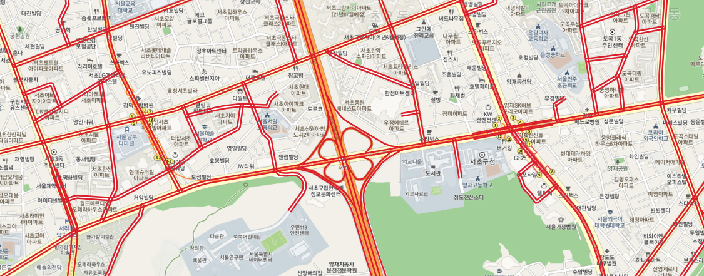

# 1. QGIS 파이썬 콘솔로 작업하기

- QGIS에서 파이썬 콘솔 실행(CTRL + ALT + P)
  - 아래의 텍스트 편집기가 표시 되며 파이썬 코드 실행 가능
    

# 2. 레이어 로딩하기

- 파이썬 콘솔 창에 아래 코드 입력
- 2가지 방법이 있음(QgsProject, iface)

## 2.1 방법1

- QgsProject 의 addMapLayers method 사용

```python
link = QgsVectorLayer(r'D:\data\[2021-04-05]NODELINKDATA\MOCT_LINK.shp', 'mLink','ogr')
node = QgsVectorLayer(r'D:\data\[2021-04-05]NODELINKDATA\MOCT_NODE.shp', 'mNode','ogr')
QgsProject.instance().addMapLayers([link, node])
```


- **QgsVectorLayer** : path 파일을 통해 Vector Layer 객체를 생성
  - path : 파일 경로 지정(메모리일 경우 별도 포맷으로 입력)
  - 레이어명칭 : 레이어 대표 명칭 입력
  - provider : 동작을 수행할 provider 입력
- **addMapLayers** : vector Layer객체를 Map layer에 추가한다.

## 2.2 방법2

- iface 사용

```python
ilink = iface.addVectorLayer(r'D:\data\[2021-04-05]NODELINKDATA\MOCT_LINK.shp', 'ifaceLink','ogr')
inode = iface.addVectorLayer(r'D:\data\[2021-04-05]NODELINKDATA\MOCT_NODE.shp', 'ifaceNode','ogr')
```


# 3. 레이어 조회, 삭제

## 3.1 레이어 조회

- QgsProject 클래스의 **mapLayers** method 사용
  - EX) 4개의 레이어 객체가 출력됨

```python
QgsProject.instance().mapLayers()
```

```text
{'ifaceLink_32ac8313_af37_4c95_a181_274d20739ec1': <QgsVectorLayer: 'ifaceLink MOCT_LINK' (ogr)>,
 'ifaceNode_848b785e_3b87_4741_96c5_d02330f04282': <QgsVectorLayer: 'ifaceNode MOCT_NODE' (ogr)>,
 'mLink_4286530d_ef44_4b31_9326_af0d07f501c2'    : <QgsVectorLayer: 'mLink' (ogr)>,
 'mNode_aee8efc1_f39c_4955_807d_a953a0cb3e6d'    : <QgsVectorLayer: 'mNode' (ogr)>}
```

## 3.2 레이어 삭제

- QgsProjet 클래스의 **removeMapLayer** method 사용
  - 인자로 상기 결과의 id값을 직접 전달
  - 또는 layer명.id() 를 인자로 전달

```python
# 1. id값을 직접 전달
QgsProject.instance().removeMapLayer('ifaceLink_32ac8313_af37_4c95_a181_274d20739ec1')

# 2. layer명.id() 를 인자로 전달
QgsProject.instance().removeMapLayer(node.id()))

# 3. 다시 레이어 조회
QgsProject.instance().mapLayers()
```

```text
{'ifaceNode_848b785e_3b87_4741_96c5_d02330f04282': <QgsVectorLayer: 'ifaceNode MOCT_NODE' (ogr)>,
 'mLink_4286530d_ef44_4b31_9326_af0d07f501c2'    : <QgsVectorLayer: 'mLink' (ogr)>}
```

# 4. 레이어 속성

## 4.1 레이어 좌표계 확인

- **좌표계 대표 명칭 확인**

```python
crs = link.crs()
crs.description()
```

```text
'ITRF2000_Central_Belt_60'
```

- **좌표계 WKT로 표현**

```python
crs.toWkt()
```

```text
'PROJCS[
    "ITRF2000_Central_Belt_60"
    ,GEOGCS["ITRF2000"
        ,DATUM["International_Terrestrial_Reference_Frame_2000"
            ,SPHEROID["GRS 1980",6378137,298.257222101]
            ,AUTHORITY["EPSG","6656"]
        ]
        ,PRIMEM["Greenwich",0]
        ,UNIT["Degree",0.0174532925199433]
    ]
    ,PROJECTION["Transverse_Mercator"]
    ,PARAMETER["latitude_of_origin",38]
    ,PARAMETER["central_meridian",127]
    ,PARAMETER["scale_factor",1]
    ,PARAMETER["false_easting",200000]
    ,PARAMETER["false_northing",600000]
    ,UNIT["metre",1,AUTHORITY["EPSG","9001"]]
    ,AXIS["Easting",EAST]
    ,AXIS["Northing",NORTH]
]'
```

## 4.2 레이어 상자 경계 얻기

- **string 형태로 레이어 상자 경계 얻기**

```python
extent = link.extent()
extent.toString()
```

```text
'101766.5375999962707283,67516.4931999971158803 : 546275.7760999957099557,665746.5176000001374632'
```

- **Polygon(WKT) 형태로 레이어 상자 경계 얻기**

```python
extent.asWktPolygon()
```

```text
'POLYGON((101766.5375999962707283 67516.49319999711588025, 546275.77609999570995569 67516.49319999711588025, 546275.77609999570995569 665746.51760000013746321, 101766.5375999962707283 665746.51760000013746321, 101766.5375999962707283 67516.49319999711588025))'
```

- **상하좌우 경계 얻기**

```python
extent.xMinimum()
extent.xMaximum()
extent.yMinimum()
extent.yMaximum()
```

```text
101766.53759999627
546275.7760999957
67516.49319999712
665746.5176000001
```

## 4.3 레이어 개수 얻기

- **featureCount**

```python
link.featureCount()
```

```text
528232
```

## 4.4 레이어의 특정 feature 얻기

- **첫 번째 feature의 geometry 조회**

```python
item = link.getFeatures() # feature iterator 생성
feat = QgsFeature() # 빈 feature 생성
item.nextfeatrue(feat) # feat에 첫 번째 feature 값 할당
feat.geometry() # 첫번 째 feature의 geometry 조회
```

```text
<QgsGeometry: MultiLineString ((245889.2084229375468567 602540.10316239262465388, 245884.52438196362345479 602550.70766398275736719, 245880.58459971970296465 602562.44166173494886607, 245877.37697640058468096 602577.55608172016218305, 245874.80402102915104479 602590.92314239405095577, 245870.08166344027267769 602608.65557601337786764, 245866.1486026662751101 602619.1390588756185025, 245861.72407481138361618 602627.99418399820569903, 245850.4775304970680736 602649.69330804911442101, 245843.77653209323761985 602663.28828775370493531, 245840.21593625328387134 602674.27399252017494291, 245836.27413596049882472 602686.38314351008739322, 245833.96002093932474963 602698.12587899703066796, 245831.74675705164554529 602714.37113853613846004, 245830.48617608763743192 602739.50042814784683287, 245829.72781690946430899 602764.25725230504758656, 245829.78834916753112338 602799.52310311701148748, 245829.1886519008257892 602818.02802740619517863, 245827.46483578640618362 602836.27679859660565853, 245825.86203727853...>
```

- **vector type 확인**

```python
feat.geometry().type()
```

```text
1
```

## 4.5 필드 정보 조회

- **속성 정보 개수 조회**

```python
feat.fields().count()
```

```text
17
```

- **특정 속성정보 이름/Type 조회**

```python
feat.fields()[2].name()
feat.fields()[2].typeName()
```

```text
'T_NODE'
'String'
```

- **속성값 조회**
  - 속성 이름, 속성 번호로 조회 가능

```python
feat['T_NODE']
feat[2]
```

```text
'2630076901'
'2630076901'
```

## 4.6 반복적으로 속성 조회

- 도로명칭이 '화악산로' 인 도로 조회
  - 개수가 많아 5개 만 찾고 for문 종료

```python
idx = 0
for f in link.getFeatures():
    if f["ROAD_NAME"] == '화악산로':
        print("OK idx = ", idx)
        idx = idx+1
    if(idx == 5):
        break
```

```text
OK idx =  0
OK idx =  1
OK idx =  2
OK idx =  3
OK idx =  4
```

# 5. 신규 레이어 만들기(Point 예제)

- **메모리에 레이어 생성**

```python
theLayer=QgsVectorLayer('Point?crs=epsg:4326','SomePoints','memory')
```

- **속성 필드 추가**
  - ID 와 NAME Field 추가

```python
theFeatures = theLayer.dataProvider() # Feature를 다루는 class 할당
theFeatures.addAttributes([QgsField("ID", QVariant.Int),QgsField("Name", QVariant.String)])
```

- **레이어에 feature 추가 하기**

```python
p=QgsFeature()   # 빈 feature 생성
point = QgsPointXY(-106.3463, 34.9685) # 임시 Geometry 클래스 생성
p.setGeometry(QgsGeometry.fromPointXY(point)) # 임시 Geometry를 p feature에 set
p.setAttributes([123,"Paul"]) # 속성 정보를 p feature에 set
theFeatures.addFeatures([p]) # Features class에 p를 add
theLayer.updateExtents() # 범위를 업데이트
theLayer.updateFields() # 속성정보를 업데이트
QgsProject.instance().addMapLayers([theLayer]) # 레이어 로딩
```


# 6. PostGIS와의 연동(Polygon 예제)

- Sample 데이터를 postgres sql에 저장하고 실습 진행

  - Sample을 위해 행정 경계 데이터를 [여기](http://www.gisdeveloper.co.kr/?p=2332) 에서 다운
  - 해당 데이터의 좌표계를 EPSG4326으로 변경 후 [postgresql에 저장](https://programmerpsy.tistory.com/94?category=1009876)

- **postgresql 서버에 연결하여 polygon 데이터 조회하기**

```python

# 1. postgresql 서버에 연결하여 polygon 데이터 조회하기
import psycopg2
connection = psycopg2.connect(database='geospatial', user='postgres', password='qkrtkddus!1')
cursor = connection.cursor()
cursor.execute("select *, ST_AsTexT(geom) from tl_scco_ctprvn")
c = cursor.fetchall()

# 2. QGIS 레이어 및 Feature 생성(속성 필드 추가)
sigungu = QgsVectorLayer('Polygon','Sigungu','memory')
sigunguFeatures = sigungu.dataProvider()
sigunguFeatures.addAttributes([QgsField("ID", QVariant.Int), QgsField("Name",QVariant.String)])

# 3. QGIS 레이어에 postgresql 에서 조회해온 데이터 삽입하기
for poly in c:
  g=QgsGeometry.fromWkt(poly[5])  # geometry 저장
  p=QgsFeature()      # 빈 feature 생성
  p.setGeometry(g)    # feature 에 geometry setting
  p.setAttributes([poly[1], str(poly[3])]) # feature 에 속성 setting
  sigunguFeatures.addFeatures([p]) # features 변수에 feature 추가
  sigungu.updateExtents() # 범위를 업데이트
  sigungu.updateFields() # 속성정보를 업데이트
  QgsProject.instance().addMapLayers([sigungu]) # 레이어 로딩
```


# 7. Feature 추가, 편집, 삭제, 조회

- 앞선 2. 레이어 로딩하기에서 로딩한 Node 데이터로 예제 진행
- **레어어에 가능한 작업 리스트 확인**

```python
node.dataProvider().capabilitiesString()
```

```text
'객체 추가, 객체 삭제, 속성 값 변경, 속성 추가, 속성 삭제, 속성 이름 바꾸기, 공간 인덱스 생성, 속성 인덱스 생성, ID로 빠른 객체 접근, 도형 변경'
```

## 7.1 Feature 추가

- **새로운 Node 1개 추가**

```python
feat = QgsFeature(node.fields())
feat.setAttribute('NODE_ID', 99999999999)
feat.setAttribute('NODE_TYPE', 1)
# 또는 위의 코드를 아래와 같이 한줄로 표현 가능
# feat.setAttributes([999999999999, 1 , ...속성값들])
feat.setGeometry(QgsGeometry.fromPointXY(QgsPointXY(221689.09,462751.59)))
node.dataProvider().addFeatures([feat])
```

| 추가 전                           | 추가 후                          |
| --------------------------------- | -------------------------------- |
|  |  |

## 7.2 Feature 삭제

- **차선이 1개인 링크 삭제**

```python
deleteList = []
for x in link.getFeatures():
  if x["LANES"] == 1:
    deleteList.append(x.id())
link.dataProvider().deleteFeatures(deleteList)
```

| 삭제 전                              | 삭제 후                             |
| ------------------------------------ | ----------------------------------- |
|  |  |

## 7.3 Feature 편집

- **'서울외곽순환고속도로' 링크를 '수도권제1순환고속도로'로 명칭 변경**

```python
for x in link.getFeatures():
  if x['ROAD_NAME'] == '서울외곽순환고속도로':
    link.dataProvider().changeAttributeValues({x.id():{7:'수도권제1순환고속도로'}})
```

| 변경 전                              | 변경 후                             |
| ------------------------------------ | ----------------------------------- |
|  |  |

## 7.4 Feature 선택(수식 이용)

- **도로번호가 1이면서 도로명이 '경부고속도로인 링크 선택하기**

```python
link.selectByExpression("ROAD_NO=1 and ROAD_NAME='경부고속도로'")
```

| 변경 전                              | 변경 후                             |
| ------------------------------------ | ----------------------------------- |
|  |  |

# 8. Toolbox

## 8.1 Toolbox 사용하기

- **사용 가능한 Toolbox 기능 리스트 확인하기**
  - **QgsApplication.processingRegistry().algorithms()** : 사용 가능한 알고리즘 전체 객체 리스트
  - **alg.provider().name()** : 알고리즘 provider 이름
  - **alg.name()** : 알고리즘 이름
  - **alg.displayName()** : 알고리즘 표시 이름

```python
from qgis import processing
for alg in QgsApplication.processingRegistry().algorithms():
  print("{}:{} --> {}".format(alg.provider().name(), alg.name(), alg.displayName()))
```

```text
GDAL:aspect --> 경사 방향
GDAL:assignprojection --> 투영체 적용
GDAL:buffervectors --> 벡터 버퍼
GDAL:buildvirtualraster --> 가상 래스터 생성
GDAL:buildvirtualvector --> 가상 벡터 생성
GDAL:cliprasterbyextent --> 범위로 래스터 자르기
...
```

- **알고리즘 이름으로 찾기**

```python
[x.id() for x in QgsApplication.processingRegistry().algorithms() if "buffer" in x.id()]
```

```text
['gdal:buffervectors', 'gdal:onesidebuffer', 'grass7:r.buffer', 'grass7:r.buffer.lowmem', 'grass7:v.buffer', 'native:buffer', 'native:bufferbym', 'native:multiringconstantbuffer', 'native:singlesidedbuffer', 'native:taperedbuffer', 'native:wedgebuffers', 'qgis:variabledistancebuffer', 'saga:fixeddistancebuffer', 'saga:rasterbuffer', 'saga:rasterproximitybuffer', 'saga:thresholdrasterbuffer', 'saga:variabledistancebuffer']
```

- **알고리즘 사용방식 확인**

```python
processing.algorithmHelp("native:buffer")
```

```text
버퍼 (native:buffer)

이 알고리즘은 고정 또는 동적 거리를 사용해서 입력 레이어의 모든 객체에 대해 버퍼 영역을 계산합니다.

둥근 오프셋을 생성하는 경우 선분 파라미터가 사분원을 비슷하게그리는 데 사용할 라인 선분의 개수를 제어합니다.

선끝(end cap) 스타일 파라미터는 버퍼 내부에서 라인 끝부분을 어떻게 처리할지 제어합니다.

결합 스타일 파라미터는 오프셋이 라인의 모서리에 적용될 경우 결합 부위를 둥글게(round) 할지, 마이터(miter)로 할지, 비스듬하게(bevel) 할지 지정합니다.

마이터 제한 파라미터는 마이터 결합 스타일에만 적용할 수 있으며, 마이터 결합 부위를 생성하는 경우 사용할 오프셋 곡선으로부터의 최대 거리를 제어합니다.


----------------
Input parameters
----------------

INPUT: 입력 레이어

	Parameter type:	QgsProcessingParameterFeatureSource

	Accepted data types:
		- str: 레이어 ID
		- str: 레이어 이름
		- str: 레이어 원본
		- QgsProcessingFeatureSourceDefinition
		- QgsProperty
		- QgsVectorLayer

DISTANCE: 거리

	Parameter type:	QgsProcessingParameterDistance

	Accepted data types:
		- int
		- float
		- QgsProperty

SEGMENTS: 선분

	반올림한 오프셋을 생성하는 경우, 선분 파라미터가 사분원을 근사치로 계산하기 위해 사용할 라인 선분의 개수를 제어합니다.

	Parameter type:	QgsProcessingParameterNumber

	Accepted data types:
		- int
		- float
		- QgsProperty

END_CAP_STYLE: 선끝 스타일

	Parameter type:	QgsProcessingParameterEnum

	Available values:
		- 0: 둥글게
		- 1: 평평하게
		- 2: 정사각형

	Accepted data types:
		- int
		- str: int를 표현하는 문자열, 예. '1'
		- QgsProperty

JOIN_STYLE: 이음새 스타일

	Parameter type:	QgsProcessingParameterEnum

	Available values:
		- 0: 둥글게
		- 1: 마이터(miter)
		- 2: 비스듬하게(bevel)

	Accepted data types:
		- int
		- str: int를 표현하는 문자열, 예. '1'
		- QgsProperty

MITER_LIMIT: 마이터 제한

	Parameter type:	QgsProcessingParameterNumber

	Accepted data types:
		- int
		- float
		- QgsProperty

DISSOLVE: 결과물 디졸브

	Parameter type:	QgsProcessingParameterBoolean

	Accepted data types:
		- bool
		- int
		- str
		- QgsProperty

OUTPUT: 산출물

	Parameter type:	QgsProcessingParameterFeatureSink

	Accepted data types:
		- str: 대상 벡터 파일, 예. 'd:/test.shp'
		- str: 임시 메모리 레이어에 결과를 저장하는 'memory :'
		- str: 벡터 공급자 ID 접두사 및 대상 URI 사용, 예. PostGIS 테이블에 결과를 저장하는 'postgres:…'
		- QgsProcessingOutputLayerDefinition
		- QgsProperty

----------------
Outputs
----------------

OUTPUT:  <QgsProcessingOutputVectorLayer>
	산출물
```

- **알고리즘 사용하기(buffer)**

```python
result = processing.run("native:buffer",{'INPUT':'mNode','DISTANCE':10,'SEGMENTS':5, 'END_CAP_STYLE':0,'JOIN_STYLE':0,'MITER_LIMIT':2, 'DISSOLVE':False,'OUTPUT':'memory:'})
QgsProject.instance().addMapLayer(result['OUTPUT'])
```


## 8.2 Toolbox 만들기

- [Toolbox 만들기](https://www.youtube.com/watch?v=kkrqnj-iUHM)

# 참고

- 파이썬을 활용한 지리공간 분석 마스터하기
- 예제는 [국가표준노드링크](https://its.go.kr/nodelink/nodelinkRef)로 진행
- QGIS 파이썬 라이브러리는 [여기](https://qgis.org/pyqgis/3.16/core/) 참고
