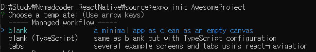
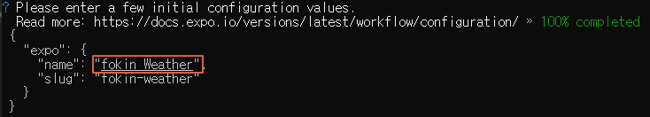
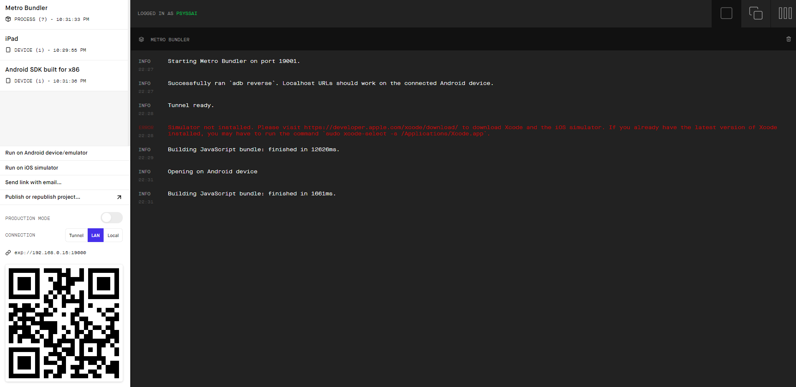
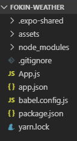

안녕하세요. PSYda 입니다.

Nomad Coders의 React Native로 날씨앱 만들기 과정을 통해 학습한 내용을 정리중입니다.

[여기](https://academy.nomadcoders.co/courses/) 사이트를 통해 무료 교육과 필요시 유료 교육을 들으실 수 있고, 강사님이 개발자들에 필요한 유용한 정보들을 [Youtube](https://www.youtube.com/channel/UCUpJs89fSBXNolQGOYKn0YQ)에도 올려주시니 구독하시고 자주 들으시면 도움이 될 것 같습니다.

이번 포스팅에서 알아볼 내용은 아래와 같습니다.

<div id = "summary">
<br>
<ol>
    <li><strong>React Native Requirements</strong></li>
    <li><strong>Expo vs RN CLI</strong></li>
    <li><strong>Create the project</strong></li>
    <li><strong>Getting to know Expo</strong></li>
    <li><strong>5.How does React Native Work?</strong></li>
</ol>
</div>

# 1.Requirements
1) **node.js(v 10.0 이상)**
2) **npm(v 6.0 이상)**
3) **Simulator**
    - PC와 휴대폰에서 simulation(test) 가 가능함
    - PC용 : <u>**Xcode(ios, Mac only)**</u>, <u>**android studio(android)**</u>
    - 휴대폰용 : <u>**expo(android)**</u> or <u>**expo client(ios)**</u> 를 휴대폰에 설치

4) **expo-cli 설치**
```cmd
npm install -g expo-cli
```

# 2.Expo vs RN CLI
[React Native 공식 홈페이지](https://facebook.github.io/react-native/docs/getting-started)를 참고하면, 두 가지 방법(Expo CLI와 React Native CLI)으로 React Native를 시작할 수 있습니다.
# 2.1 Expo CLI
1) ios/android에서 실행 가능하도록 기본 Setting된 상태로 Project를 생성해주는 도구
2) native files을 제어하지 못함
    - expo에서 native files을 대신 관리
3) 효과적인 Test환경
    - 휴대폰에서 Simulation 및 Test 가능함
    - ios / andorid 앱을 Build 해줌
4) Expo에 의존적
    - expo에서 제공하는 기능들만 사용 가능함
5) 방대한 라이브러리
    - React Native에서 제공하는 라이브러리 보다 더 많은 라이브러리 제공

# 2.2 React Native CLI
1) React Native를 수동으로 작업하고 싶을 때 사용하는 도구(CLI)
2) native files을 더 많이 컨트롤 하고 싶을 때 사용
3) native 개발과 병행하여 개발 가능함
4) Setting 과정이 복잡함
5) 빌드환경 필요함
    - ios를 빌드하기 위해서는 Mac 이 필요함

# 3.Create the Project(using Expo)
# 3.1 React Native App Project 만들기
1) 터미널에서 <u>**expo init [프로젝트명]**</u> 입력
```cmd
expo init fokin-weather
```
2) **프로젝트 템플릿 선택**
    - blank, blank(TypeScript), tabs 중에 선택


3) **프로젝트 이름 설정**
    - "name" 항목에 Project 이름 입력 후 엔터


4) **yarn 사용 여부 설정(y or n)**


5) **프로젝트 실행**
    - 프로젝트 폴더로 이동
    - **<span style="color:red">yarn start</span>** 입력
    - expo 브라우저 확인

# 3.2 Project 구성

1) **package.json**
2) **babel.config.js**
3) **app.json**
    - Expo가 읽게 될 application 설정 파일
4) **App.js**
    - React Component

# 3.3 휴대폰에서 App Test 하기
expo를 실행하는 PC와 휴대폰이 동일한 wifi를 사용해야합니다.
1) Android
    - Android 휴대폰에서 Expo app 실행
    - 실행된 Metro Bundler의 좌측 QR코드를 Expo app을 이용해 읽기

2) ios
    - PC 터미널에서 expo login 실행하여 E-mail + pwd 입력
    - ios 휴대폰에서 Expo client 실행 및 로그인
    - Projects tab -> RECENTLY IN DEVELOPMENT 에서 프로젝트 실행
    

# 3.4 PC 에서 App Test 하기
1) Android
    - Android studio 실행
    - 프로젝트 생성
    - AVD(Android Virtual Devices) manager 실행(핸드폰 모양 아이콘)가상 Simulation 구동
    - 가상 Simulation 생성 및 실행
    - 터미널에서 expo project 실행(yarn start)
    - Run on Android device 실행

2) ios
    - Mac PC에서만 가능
    - 터미널에서 expo project 실행(yarn start)
    - Run on iOS simulator 실행

# 4. Getting to know Expo( Expo 살펴 보기 )
1) **live reloading & hot reloading 지원**
    - live reloading : 코드 변경 즉시 변경분을 전체 새로고침하여 simulator에 표시
    - hot reloading : 앱의 상태를 잃지 않고 변경된 부분만 새로 고침하여 표시

2) **개발자 모드 접속**
    - 휴대폰을 흔들면 접속 가능
    - Debug JS Remotely : debug를 도와주며, 속도를 느리게함(필요한 경우에만 사용)

3) **명령어(package.json 참고)**
    - yarn android 또는 yarn ios : expo App을 Simulator에서 실행하는 명령어
    - yarn eject : expo 에서 eject 할 때 사용

# 5.How does React Native Work?
# 5.1 모바일 App을 만드는 2가지 방법
1) **native**
    - ios, android 의 순수 개발 언어(swift, objective-c, java 등)으로 만드는 것

2) **App 기반 Web view를 만드는 방법**
    - App안에서 작동하는 웹사이트(하이브리드 방법)
    - 껍데기는 cordova or phoneGap에 의해 만들어진 native
    - 보여주는 내용은 HTML, CSS, javascript로 동작
    - react native도 이런 방식임

# 5.2 react native 살펴보기
1) **bridge** : react로 작성된 코드를 native와 연결시켜 주는 것
    - react native에서는 항상 bridge가 필요하며, 속도 저하가 발생 할 수 있음.
    - ex) Text , View 등
2) **View** : div와 비슷한 개념으로 app의 모든 것이 view
3) **Text** : 글자를 넣을 때 사용 span과 비슷한 개념
4) **StyleSheet** : css와 비슷한 개념

이번 포스팅은 여기서 마치겠습니다.

감사합니다.