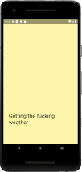
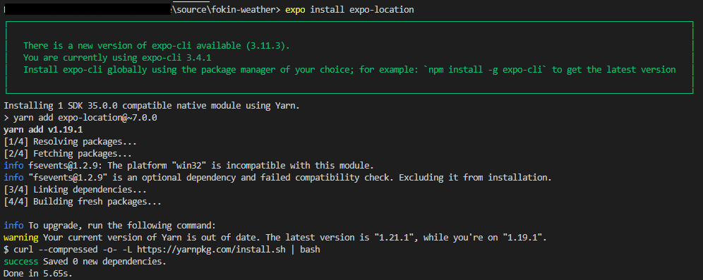

안녕하세요. PSYda 입니다.

Nomad Coders의 React Native로 날씨앱 만들기 과정을 통해 학습한 내용을 정리중입니다.

[여기](https://academy.nomadcoders.co/courses/) 사이트를 통해 무료 교육과 필요시 유료 교육을 들으실 수 있고, 강사님이 개발자들에 필요한 유용한 정보들을 [Youtube](https://www.youtube.com/channel/UCUpJs89fSBXNolQGOYKn0YQ)에도 올려주시니 구독하시고 자주 들으시면 도움이 될 것 같습니다.

이번 포스팅에서 알아볼 내용은 아래와 같습니다.

<div id = "summary">
<br>
<ol>
    <li><strong>Layouts with flexbox in React Native</strong></li>
    <li><strong>Loading screen</strong></li>
    <li><strong>Getting the location</strong></li>
    <li><strong>Getting the weather</strong></li>
</ol>
</div>

# 1.Layouts with flexbox in React Native

1. **React Native에서는 <span style="color:red">flex</span>를 이용해 layout 하는 것을 추천!**
2. **Default flexDirection는 <span style="color:red">컬럼</span>!**
   - 변경하고 싶으면 <strong><u>flexDirection:"row"</u></strong> 입력!

# 1.1 flex를 통해 layout 하기!

1. **부모 요소에서 flex를 설정**
2. **자식 요소에서 분할할 비율을 설정**
   - 만약 2개의 자식이 있을 때
   - 각각 flex:1 로 설정하면 50% 씩 분할함
   - 각각 flex:1 과 flex:2를 주면 1/3 , 2/3 영역을 분할함
3. **예시(50% 분할)**

```js
//View Container 설정
;<View style={styles.container}>
  <View style={styles.yellowView} />
  <View style={styles.blueView} />
</View>

const styles = StyleSheet.create({
  container: {
    flex: 1,
  },
  yellowView: {
    flex: 1,
    backgroundColor: "yellow",
  },
  blueView: {
    flex: 1,
    backgroundColor: "blue",
  },
})
```

    - 결과


4. **예시2(1/3 , 2/3 분할)**

```js
yellowView: {
    flex:1,
    backgroundColor:"yellow"
},
blueView: {
    flex:2,
    backgroundColor:"blue"
}
```

    - 결과


# 2.Loading screen

최초 Loading 화면을 만든다.

# 2.1 첫번째 Loading 화면 만들기

1. **loading.js 컴포넌트 생성**

```js
import React from "react"
import { StyleSheet, Text, View } from "react-native"
export default function Loading() {
  return
  ;<View style={styles.container}>
    <Text style={styles.text}>Getting the fucking weather</Text>
  </View>
}
const styles = StyleSheet.create({
  container: {
    flex: 1,
    justifyContent: "flex-end",
    paddingHorizontal: 30,
    paddingVertical: 100,
    backgroundColor: "#FDF6AA",
  },
  text: {
    color: "#2c2c2c",
    fontSize: 30,
  },
})
```

2. **App.js 에서 Loading 컴포넌트 불러오기**

```js
import React from "react"
import Loading from "./Loading"
export default function App() {
  return <Loading />
}
```

3. **결과**
   

# 3.Getting the location

만약 App에 위치 정보를 사용하고 싶을 때 **[react native](https://facebook.github.io/react-native/docs/geolocation#__docusaurus)**와 **[expo](https://docs.expo.io/versions/v33.0.0/sdk/location/)**에서 제공하는 API를 사용 할 수 있다.  
링크된 페이지를 참고하면 **<span style="color:red">expo의 location이 더 많고 유용한 라이브러리를 제공</span>**하는 것을 알 수 있다(ex.Geofencing : 사용자가 특정 지역에 들어올 때 특정 함수를 호출하는 기능).  
따라서 본 포스팅에서는 expo의 location을 이용하며, 사용하기 위해서는 라이브러리 설치가 필요하다.

# 3.1 Expo의 location library 설치

1. **터미널에서 <span style="color:red">expo install expo-location</span> 입력**

```cmd
expo install expo-location
```

2. **결과**
   

# 3.2 location library import

1. **location을 사용할 파일에서 import**
   - App.js에 아래와 같이 입력

```js
import * as Location from "expo-location"
```

# 3.3 location library 사용

1. **권한정보가져오기**
   - **비동기식(async await)** 방법 사용
   - **<span style="color:red">requestPermissionsAsync() 함수</span>** 사용
   - **try ~ catch 구문**을 이용해 에러 발생시 alert 발생
2. **위치 정보 가져 오기**
   - **비동기식(async await)** 방법 사용
   - **componentDidMount()**를 이용해 컴포넌트 생성이 완료되었을 때 **<span style="color:red">getLocation</span>**을 실행
   - 위치는 **<span style = "color:red">getCurrentPositionAsync() 함수</span>**를 이용
3. **<span style="color:red">state</span>를 이용해 Loading완료시 Loading 컴포넌트 해제**
4. **코드**

```js
//App.js
export default class App extends React.Component {
  state = {
    isLoading: true,
  }
  getLocation = async () => {
    try {
      await Location.requestPermissionsAsync()
      const {
        coords: { latitude, longitude },
      } = await Location.getCurrentPositionAsync()
      this.setState({ isLoading: false })
    } catch (error) {
      Alert.alert("Can't find you.", "So sad")
    }
  }
  componentDidMount() {
    this.getLocation()
  }
  render() {
    const { isLoading } = this.state
    return isLoading ? <Loading /> : null
  }
}
```

# 4 Getting the weather

# 4.1 API KEY 생성

1. **사용할 API : [openweathermap.org](https://openweathermap.org)**
2. 위의 사이트에서 회원가입 및 로그인 하고, **<span style="color:red">API key를 생성</span>**한다.
3. 생성한 API key를 복사하여 app.js에 **<span style="color:red">API_KEY 변수로 저장</span>**한다.
   - 코드

```js
//App.js
const API_KEY = "478d7b0a018~~~~"
```

# 4.2 axios를 이용한 데이터 가져오기

1. **axios 설치 및 import**
   - **yarn add axios**를 이용해 axios 설치

```cmd
yarn add axios
```

    - **import axios from "axios"**;

2. **<span style="color:red">axios.get</span>을 이용해 weather 정보 얻기**
   - 인자로 **latitude, longitude, API_KEY**를 전달
   - 코드

```js
//App.js의 App Component
getWeather = async (latitude, longitude) => {
  const { data } = await axios.get(
    `http://api.openweathermap.org/data/2.5/weather?lat=${latitude}&lon=${longitude}&APPID=${API_KEY}`
  )
  console.log(data)
}
```

# 4.3 최종 App.js

```js
import React from "react"
import { Alert } from "react-native"
import Loading from "./Loading"
import * as Location from "expo-location"
import axios from "axios"
const API_KEY = "478d7b0a01822840e15f70ddfa48c723"

export default class App extends React.Component {
  state = {
    isLoading: true,
  }
  getWeather = async (latitude, longitude) => {
    const { data } = await axios.get(
      `http://api.openweathermap.org/data/2.5/weather?lat=${latitude}&lon=${longitude}&APPID=${API_KEY}`
    )
    console.log(data)
  }

  getLocation = async () => {
    try {
      await Location.requestPermissionsAsync()
      const {
        coords: { latitude, longitude },
      } = await Location.getCurrentPositionAsync()
      this.getWeather(latitude, longitude)
      this.setState({ isLoading: false })
    } catch (error) {
      Alert.alert("Can't find you.", "So sad")
    }
  }
  componentDidMount() {
    this.getLocation()
  }
  render() {
    const { isLoading } = this.state
    return isLoading ? <Loading /> : null
  }
}
```

이번 포스팅은 여기서 마치겠습니다.

감사합니다.
